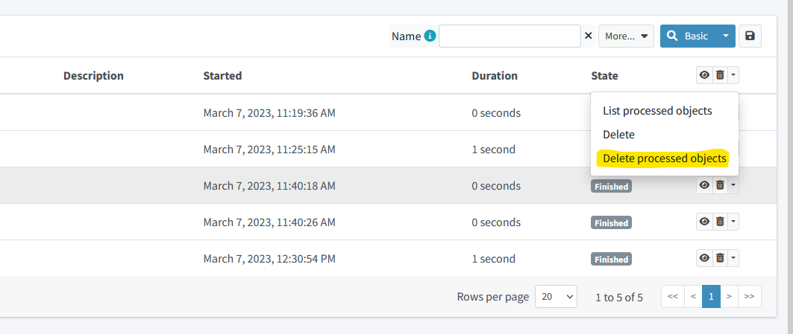

= Simulation Result
:page-since: "4.7"

Each activity, regardless of whether it is running on foreground or on background, may create so-called _simulation result_.
It is a special type of objects in the midPoint repository.
A simulation result collects information about:

. objects seen by the activity (both midPoint repository objects and resource objects),
. changes computed against these objects,
. values of so-called xref:metrics.adoc[simulation metrics] that provide high-level view of the activity being simulated.

== Removing Details of Processed Objects

Simulation results storage is modular in the sense that - in order to spare the space used - it is possible to leave out the storage of individual objects and changes projected against them.
In such cases, only the metrics values are stored.

This elimination of details can be done in various ways:

. via GUI (see xref:#_figure1[] below),
. using a clean-up task (planned for future),
. via experimental midPoint Java API (`RepositoryService.deleteSimulatedProcessedObjects`),
. right in the database, e.g. by deleting the whole xref:definition.adoc#_partitions[simulation result partition].

[#_figure1]
.Deleting processed objects

// #TODO - authorizations in code#
// #TODO - deleting the partitions#
