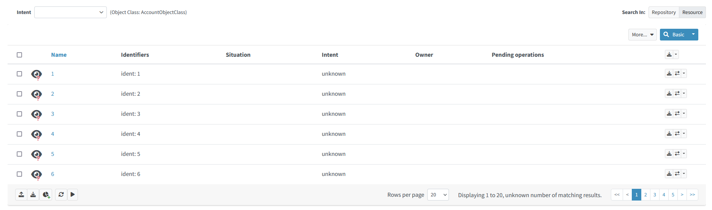
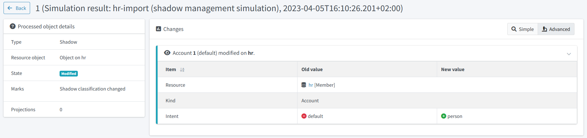
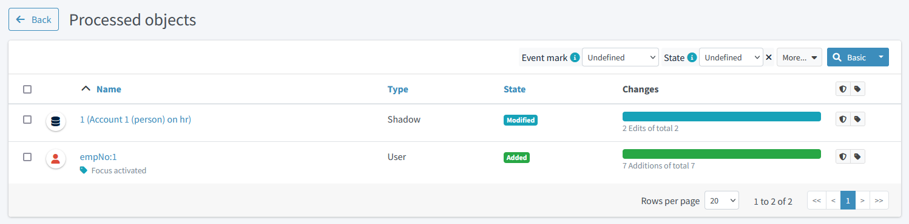
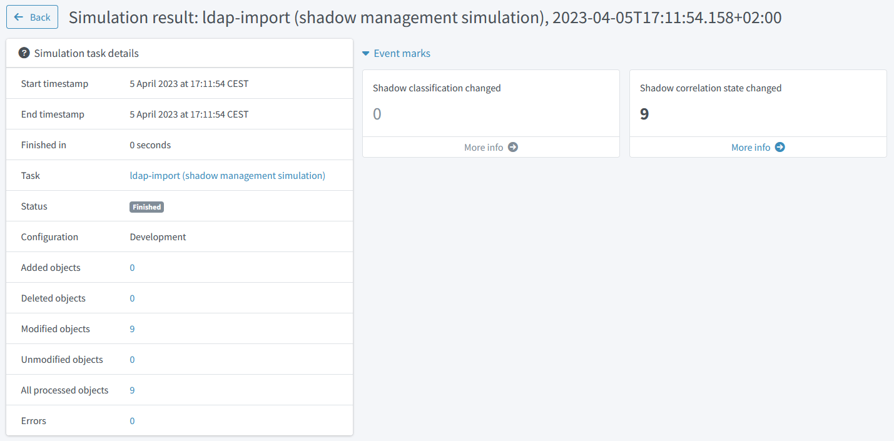
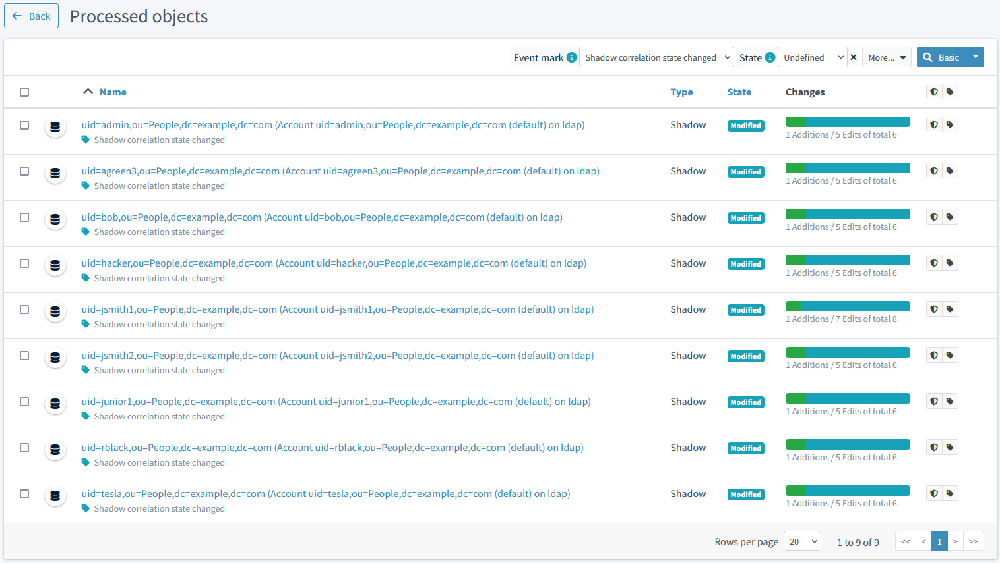
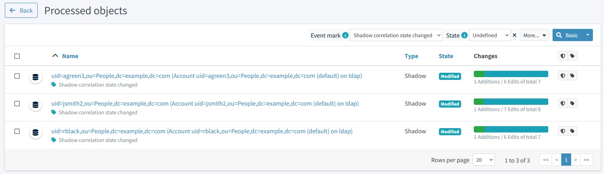
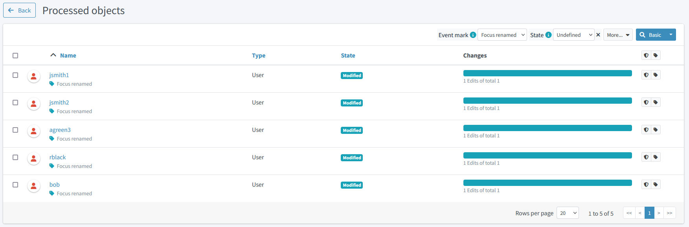

= Simple Simulation Tutorial
:page-toc: top
:page-since: "4.7"
:page-upkeep-status: green

This is a simple tutorial describing the new xref:/midpoint/reference/simulation/[simulation] feature.

NOTE: The reader is expected to have reasonable knowledge of midPoint; we don't describe individual steps in much detail here.

NOTE: The simulations feature requires midPoint 4.7 or later and the native (PostgreSQL-based) repository.

The overall scenario is that we connect the HR system, represented by a CSV file, to midPoint.
Then, we will connect the target LDAP-based system, represented again by a CSV file.

The source files for this tutorial are in the link:https://github.com/Evolveum/midpoint-samples/tree/master/samples/simulation/tutorial[midPoint samples] repository.

== Connecting the Source (HR) System

=== Step HR-1: Viewing the Raw HR Data

. Create a directory for CSV files (like `~/sim-tutorial`) and copy the link:https://github.com/Evolveum/midpoint-samples/tree/master/samples/simulation/tutorial/hr.csv[HR CSV file] there.
. Check that the `filePath` in link:https://github.com/Evolveum/midpoint-samples/tree/master/samples/simulation/tutorial/resource-hr-1.xml[HR definition #1] matches the location of the copied HR CSV file.
. Import the HR definition #1 into midPoint.
Note that the lifecycle state of the resource is `proposed`, so the whole resource definition is in the development mode.
+
.Listing 1: The resource definition #1
[source,xml]
----
<resource oid="236dd5ca-47df-403c-82e1-9ce2f36be000">
    <name>hr</name>
    <lifecycleState>proposed</lifecycleState>
    <connectorRef type="ConnectorType"> ... </connectorRef>
    <connectorConfiguration> ... </connectorConfiguration>
</resource>
----

. List the accounts on the resource.
You should see something like this:
+
.Content of the HR resource

Note that the accounts are not classified: their intent is `unknown`.

=== Step HR-2: Definition of an Object Type

The initial definition contains no object types.
So, let us define one.
Please import link:https://github.com/Evolveum/midpoint-samples/tree/master/samples/simulation/tutorial/resource-hr-2.xml[HR definition #2].
(Do not forget to check the CSV file location, as usual).

.Listing 2: The resource definition #2
[source,xml]
----
<resource oid="236dd5ca-47df-403c-82e1-9ce2f36be000">
    <name>hr</name>
    <lifecycleState>proposed</lifecycleState>
    <connectorRef type="ConnectorType"> ... </connectorRef>
    <connectorConfiguration> ... </connectorConfiguration>
    <schemaHandling>
        <objectType>
            <kind>account</kind>
            <intent>default</intent>
            <default>true</default>
            <delineation>
                <objectClass>ri:AccountObjectClass</objectClass>
            </delineation>
        </objectType>
    </schemaHandling>
</resource>
----

Now, list the accounts on the resource again.
You should see something like this:

.Content of HR resource with preliminary classification

The intents were immediately set to `default`, because the accounts were not classified before.

[#_reclassification]
=== Step HR-3: Change the Definition of the Object Type

Imagine we want to change the definition of the object type so that real persons (recognized by having a non-empty last name) will have the intent of `person` instead of `default`.
Let us do that in link:https://github.com/Evolveum/midpoint-samples/tree/master/samples/simulation/tutorial/resource-hr-3.xml[HR definition #3].

.Listing 3: The resource definition #3
[source,xml]
----
<resource oid="236dd5ca-47df-403c-82e1-9ce2f36be000">
    <name>hr</name>
    <lifecycleState>proposed</lifecycleState>
    <connectorRef type="ConnectorType"> ... </connectorRef>
    <connectorConfiguration> ... </connectorConfiguration>
    <schemaHandling>
        <objectType>
            <kind>account</kind>
            <intent>person</intent>
            <delineation>
                <objectClass>ri:AccountObjectClass</objectClass>
                <filter>
                    <q:description>Everyone with non-empty last name is a person</q:description>
                    <q:text>attributes/lastname exists</q:text>
                </filter>
            </delineation>
        </objectType>
        <objectType>
            <kind>account</kind>
            <intent>default</intent>
            <delineation>
                <objectClass>ri:AccountObjectClass</objectClass>
                <filter>
                    <q:description>Everyone with empty last name is not a person</q:description>
                    <q:text>attributes/lastname not exists</q:text>
                </filter>
            </delineation>
        </objectType>
    </schemaHandling>
</resource>
----

Now, let us import the definition and check the accounts.
Their intents have not changed.
Why?
Because midPoint does the reclassification very carefully, in order to avoid breaking things.
In general, a shadow is classified or re-classified only if:

. It was not classified yet.
. Or, it was classified, but the corresponding type (pointed to by kind and intent) no longer exists.
. Or, it was classified, the corresponding type exists, and all the following conditions are met:
.. the current shadow type is part of the development configuration,
.. and the operation is able to see the development configuration.

By default, the GUI does not engage the development configuration when listing the content of a resource.
Hence, our shadows are not reclassified when looking at them.

To re-classify the accounts from `default` to `person` we have the following options:

. Delete the shadows and let midPoint re-create them.
(This was the only way before version 4.7.)
. Read the content of the resource with the development configuration enabled.
(This implies the simulation mode.)
This is currently doable using synchronization (e.g. import) tasks.
Here are two alternatives:
a. Execute the re-classification directly.
b. Simulate the re-classification.
Unlike the standard simulation, this is a special low-level simulation that captures assumed changes on shadow objects.
In 4.7, it is xref:/midpoint/versioning/experimental/[experimental functionality].

Let us go through options 2b and 2a now.

==== Simulation of Re-classification Process

++++

++++

===== Running the Simulation

Import the following link:https://github.com/Evolveum/midpoint-samples/tree/master/samples/simulation/tutorial/task-hr-import-shadow-management-simulation.xml[task]:

.Listing 4: A task that simulates the accounts re-classification
[source,xml]
----
<task xmlns="http://midpoint.evolveum.com/xml/ns/public/common/common-3"
      xmlns:ri="http://midpoint.evolveum.com/xml/ns/public/resource/instance-3"
      oid="e44cd468-70e0-44b4-a25e-c26ccfdfb33d">
    <name>hr-import (shadow management simulation)</name>
    <executionState>runnable</executionState>
    <activity>
        <work>
            <import>
                <resourceObjects>
                    <resourceRef oid="236dd5ca-47df-403c-82e1-9ce2f36be000"/>
                    <objectclass>ri:AccountObjectClass</objectclass>
                </resourceObjects>
            </import>
        </work>
        <execution>
            <mode>shadowManagementPreview</mode> <!--1-->
            <configurationToUse>
                <predefined>development</predefined> <!--2-->
            </configurationToUse>
        </execution>
        <reporting>
            <simulationResult/> <!--3-->
        </reporting>
    </activity>
</task>
----
<1> Selects the (experimental) low-level simulation that captures changes to the shadows during classification and correlation.
<2> Instructs midPoint to use development configuration, not the production one.
<3> Enables the creation of the simulation result object.
Without this option, the simulation would run, but its results would not be captured.

===== Viewing the Results

After running this task, the classification of the shadows will _not_ change, but a new simulation result is created.
It looks like this:

.Simulation result capturing the shadows reclassification

We see that the classification of both shadows would be changed.
We can look at the details by clicking on "Shadow classification changed" mark:

.Reclassified objects
image::result-after-reclassification-details.png[Reclassified objects, width=1600]

And then on a shadow.
After clicking on _Advanced_ button the details will be shown:

.Reclassified object details

===== Creating a Report

The results can be also exported into CSV, by running a report named _Simulation report: Items changed_, with the following parameters:

[%autowidth]
[%heading]
|===
| Parameter | Value | Description
| Simulation result | choose the simulation result |
| Paths to include | `ShadowType` `intent` | to avoid showing other changes, e.g. those of synchronization timestamps
| Show rows with no details | `false` | to show only the really changed values
|===

(The preview in GUI does not work with these kinds of reports.
You have to execute the report to create the CSV file.)

After opening the CSV in the spreadsheet and hiding unimportant columns it will look like this:

.Reclassified objects report
image::result-after-reclassification-report.png[Reclassified objects report]

==== Running the Re-classification

After we are satisfied with the expected re-classification results, we can run the re-classification in real.

There are two options:

===== Reclassification through the GUI

We can open the _Accounts_ or _Uncategorized_ panel and click on the  _Reclassify_ button.
A task is created in background.
After the task finishes, we may refresh the view to see the updated classification.

.Reclassification through the GUI

===== Running the Reclassification Task Manually

Import the following link:https://github.com/Evolveum/midpoint-samples/tree/master/samples/simulation/tutorial/task-hr-import-full-simulation-no-result.xml[task]:

.Listing 5: A task that executes the accounts re-classification
[source,xml]
----
<task xmlns="http://midpoint.evolveum.com/xml/ns/public/common/common-3"
      xmlns:ri="http://midpoint.evolveum.com/xml/ns/public/resource/instance-3"
      oid="8b169df3-3124-4e36-871f-83bb52acfd7b">
    <name>hr-import (full simulation, no result)</name>
    <executionState>runnable</executionState>
    <activity>
        <work>
            <import>
                <resourceObjects>
                    <resourceRef oid="236dd5ca-47df-403c-82e1-9ce2f36be000"/>
                    <objectclass>ri:AccountObjectClass</objectclass>
                </resourceObjects>
            </import>
        </work>
        <execution>
            <mode>preview</mode> <!--1-->
            <configurationToUse>
                <predefined>development</predefined>
            </configurationToUse>
        </execution>
        <reporting>
            <simulationResult/>
        </reporting>
    </activity>
</task>
----
<1> This is the "main" (full) simulation.
The low-level operations on shadows (classification, correlation state determination) are carried out.
Changes to focus objects and resource objects are not executed.

After running the task and listing the accounts, we see their intent was changed to `person`.

As an exercise, you can try running the simulated reclassification task again and check there are no simulated re-classification now.

=== Step HR-4: Simulation of Inbound Mappings

So we can assume the resource object classification is OK now.
Let us prepare some inbound mappings and synchronization reactions.
Please import link:https://github.com/Evolveum/midpoint-samples/tree/master/samples/simulation/tutorial/resource-hr-4.xml[HR definition #4].

.Listing 6: The resource definition #4 - with mappings and reactions
[source,xml]
----
<resource oid="236dd5ca-47df-403c-82e1-9ce2f36be000">
    <name>hr</name>
    <lifecycleState>proposed</lifecycleState>
    <connectorRef> ... </connectorRef>
    <connectorConfiguration> ... </connectorConfiguration>
    <schemaHandling>
        <objectType>
            <kind>account</kind>
            <intent>person</intent>
            <delineation>
                <objectClass>ri:AccountObjectClass</objectClass>
                <filter>
                    <q:description>Everyone with non-empty last name is a person</q:description>
                    <q:text>attributes/lastname exists</q:text>
                </filter>
            </delineation>
            <attribute>
                <ref>ri:ident</ref>
                <inbound>
                    <strength>strong</strength>
                    <expression>
                        
                    </expression>
                    <target>
                        <path>name</path>
                    </target>
                </inbound>
                <inbound>
                    <strength>strong</strength>
                    <target>
                        <path>employeeNumber</path>
                    </target>
                </inbound>
            </attribute>
            <attribute>
                <ref>ri:firstname</ref>
                <inbound>
                    <strength>strong</strength>
                    <target>
                        <path>givenName</path>
                    </target>
                </inbound>
            </attribute>
            <attribute>
                <ref>ri:lastname</ref>
                <inbound>
                    <strength>strong</strength>
                    <target>
                        <path>familyName</path>
                    </target>
                </inbound>
            </attribute>
            <attribute>
                <ref>ri:email</ref>
                <inbound>
                    <strength>strong</strength>
                    <target>
                        <path>emailAddress</path>
                    </target>
                </inbound>
            </attribute>
            <synchronization>
                <reaction>
                    <situation>linked</situation>
                    <actions>
                        <synchronize/>
                    </actions>
                </reaction>
                <reaction>
                    <situation>deleted</situation>
                    <actions>
                        <unlink/>
                    </actions>
                </reaction>
                <reaction>
                    <situation>unmatched</situation>
                    <actions>
                        <addFocus/>
                    </actions>
                </reaction>
            </synchronization>
        </objectType>
        <objectType>
            <kind>account</kind>
            <intent>default</intent>
            <!-- ... -->
        </objectType>
    </schemaHandling>
</resource>
----

Traditional import from GUI does nothing, because it simply does not "see" the resource configuration:
just as if there were no mappings nor synchronization reactions defined.

There is a possibility to preview (simulate) the import.
But be sure to select the preview that uses the development configuration, otherwise there will be no effects at all.

==== Simulated Import of a Single Account (on Foreground)

Select the account to be imported and choose _Import preview_:

.Simulated import of a single account

Now choose _Simulated development_ and click on _Select_ button:

.Simulated import of a single account (continued)

Observe the result:

.Simulated import of a single account (result)

After displaying the details of the user, we see the following:

.Preview of the first user added

We see that our mappings work correctly.

==== Simulated Import of All Accounts (on Background)

To simulate the execution of mappings for all accounts in a background task, let us import the link:https://github.com/Evolveum/midpoint-samples/tree/master/samples/simulation/tutorial/task-hr-import-simulation.xml[full simulation task].

After looking at the simulation result, we should see "6 focus activations" and after clicking on that mark, we will see users that are going to be added.

=== Step HR-5: Switching the Resource into Production

Now we can switch the resource to production mode, either by clicking on the _Switch to production_ button, or changing the lifecycle state to `Active`.

.Switching the resource into production

After that, we can run the https://github.com/Evolveum/midpoint-samples/tree/master/samples/simulation/tutorial/task-hr-import.xml[regular HR import task].

We observe that the users were added.

We may now run the simulated import and check that there are no computed changes.

=== Step HR-6: Extending the Resource

Len us imagine that we want to add a mapping for `telephoneNumber`.
Usually, we cannot put the whole resource back into development mode.
However, we can do that for the particular mapping.

Please import link:https://github.com/Evolveum/midpoint-samples/tree/master/samples/simulation/tutorial/resource-hr-5.xml[HR definition #5].

.Listing 7: New mapping, in development mode
[source,xml]
----
<resource oid="236dd5ca-47df-403c-82e1-9ce2f36be000">
    <name>hr</name>
    <lifecycleState>active</lifecycleState> <!--1-->
    <connectorRef> ... </connectorRef>
    <connectorConfiguration> ... </connectorConfiguration>
    <schemaHandling>
        <objectType>
            <kind>account</kind>
            <intent>person</intent>
            <default>true</default>
            <delineation>
                <objectClass>ri:AccountObjectClass</objectClass>
            </delineation>
            <attribute>
                <ref>ri:phone</ref>
                <inbound>
                    <lifecycleState>proposed</lifecycleState> <!--2-->
                    <strength>strong</strength>
                    <target>
                        <path>telephoneNumber</path>
                    </target>
                </inbound>
            </attribute>
            <synchronization> ... </synchronization>
        </objectType>
        <!-- ... -->
    </schemaHandling>
</resource>
----
<1> The resource as such is in production mode.
<2> This particular mapping is visible only in the development mode.

After running the (full) simulation of import from HR, the result contains deltas like this:

.Telephone number change
image::telephone-number-delta.png[Telephone number change]

After we are satisfied with the mapping, we can put it into production mode (e.g. by doing as shown in the following figure or by setting `lifecycleState` = `active` manually) and run the import task in "persistent-effects" mode.

.Switching the mapping into production

== Connecting the Target System (Simulation of LDAP)

Now, let us connect a sample target system.
Typically, this would be an LDAP (AD) one.
For simplicity, let us use a CSV resource instead.

=== Step LDAP-1: Viewing the Raw LDAP Data

. Copy the link:https://github.com/Evolveum/midpoint-samples/tree/master/samples/simulation/tutorial/ldap.csv[LDAP CSV file] to the directory for CSV files for this tutorial (e.g. `~/sim-tutorial`).
. Check that the `filePath` in link:https://github.com/Evolveum/midpoint-samples/tree/master/samples/simulation/tutorial/resource-ldap-1.xml[LDAP definition #1] matches the location of the copied LDAP CSV file.
. Import the LDAP definition #1 into midPoint.
Note that the lifecycle state of the resource is `proposed`, so the whole resource definition is in the development mode.
+
.Listing 8: The LDAP resource definition #1 (simulated by a CSV file)
[source,xml]
----
<resource oid="80d0e843-906a-4bbe-b237-bd3568ec4169">
    <name>ldap</name>
    <lifecycleState>proposed</lifecycleState>
    <connectorRef type="ConnectorType"> ... </connectorRef>
    <connectorConfiguration> ... </connectorConfiguration>
</resource>
----

. List the accounts on the resource.
You should see something like this:
+
.Content of the LDAP resource

Note that the accounts are not classified: their intent is `unknown`.

=== Step LDAP-2: Definition of an Object Type

The initial definition contains no object types.
So, let us define one.
Please import link:https://github.com/Evolveum/midpoint-samples/tree/master/samples/simulation/tutorial/resource-ldap-2.xml[LDAP definition #2].

.Listing 9: The LDAP resource definition #2
[source,xml]
----
<resource oid="80d0e843-906a-4bbe-b237-bd3568ec4169">
    <name>ldap</name>
    <lifecycleState>proposed</lifecycleState>
    <connectorRef type="ConnectorType"> ... </connectorRef>
    <connectorConfiguration> ... </connectorConfiguration>
    <schemaHandling>
        <objectType>
            <kind>account</kind>
            <intent>default</intent>
            <default>true</default>
            <delineation>
                <!-- Would be inetOrgPerson on real LDAP -->
                <objectClass>ri:AccountObjectClass</objectClass>
            </delineation>
        </objectType>
    </schemaHandling>
</resource>
----

Now, list the accounts on the resource again.
You should see something like this:

.Content of LDAP resource with classification
image::accounts-intent-default-ldap.png[Content of LDAP resource with classification]

The intents were immediately set to `default`, because the accounts were not classified before.

Let us assume we are satisfied with this.
If we would not be, we could fine-tune the classification just like in <<Step HR-3: Change the Definition of the Object Type>>.

Now let us start correlating the accounts.

=== Step LDAP-3: Correlation on Employee Number

Let us assume that some of our accounts have `employeeNumber` attribute specified.
We want to use it as the primary correlation attribute.

Please import link:https://github.com/Evolveum/midpoint-samples/tree/master/samples/simulation/tutorial/resource-ldap-3.xml[LDAP definition #3].

.Listing 10: Definition of `employeeNumber` LDAP attribute
[source,xml]
----
<attribute>
    <ref>ri:employeeNumber</ref>
    <correlator/> <!--1-->
    <inbound>
        <target>
            <path>employeeNumber</path>
        </target>
        <evaluationPhases> <!--2-->
            <include>beforeCorrelation</include>
            <exclude>clockwork</exclude>
        </evaluationPhases>
    </inbound>
</attribute>
<synchronization/> <!--3-->
----
<1> Marks `employeeNumber` as a correlation attribute.
<2> This configuration tells midPoint to execute the mapping but just for the sake of correlation, not for actual data movement from LDAP to midPoint.
(The mapping has to be there in order for the `correlator` configuration property to work.)
So, we want to correlate on this attribute by such a simple mechanism but do not want to use it to really modify the focus.
Hence, such non-intuitive configuration must be used for now.
This may happen for correlation attributes on non-authoritative resources (e.g. target ones, or "auxiliary" source ones).
We should simplify this in the future.
<3> Optional.
Note there are no reactions.
We want to do just the correlation.

Just as in <<Step HR-3: Change the Definition of the Object Type>> we have now two options:

. Execute the correlation and see the results right on the shadows.
. Simulate the correlation first (experimental feature).

==== Simulating the Correlation

++++

++++

===== Running the Simulation

Import the following link:https://github.com/Evolveum/midpoint-samples/tree/master/samples/simulation/tutorial/task-ldap-import-shadow-management-simulation.xml[task].
It is analogous to the one mentioned in <<Step HR-3: Change the Definition of the Object Type>>; only the resource reference is different.

.Listing 11: A task that simulates the accounts correlation
[source,xml]
----
<task xmlns="http://midpoint.evolveum.com/xml/ns/public/common/common-3"
      xmlns:ri="http://midpoint.evolveum.com/xml/ns/public/resource/instance-3">
    <name>ldap-import (shadow management simulation)</name>
    <executionState>runnable</executionState>
    <activity>
        <work>
            <import>
                <resourceObjects>
                    <resourceRef oid="80d0e843-906a-4bbe-b237-bd3568ec4169"/>
                    <objectclass>ri:AccountObjectClass</objectclass>
                </resourceObjects>
            </import>
        </work>
        <execution>
            <mode>shadowManagementPreview</mode> <!--1-->
            <configurationToUse>
                <predefined>development</predefined>
            </configurationToUse>
        </execution>
        <reporting>
            <simulationResult/>
        </reporting>
    </activity>
</task>
----
<1> Selects the (experimental) low-level simulation that captures changes to the shadows during classification and correlation.

===== Viewing the Results

After running this task, the correlation information in the shadows will _not_ change, but a new simulation result is created.
It looks like this:

.Simulation result capturing the first correlation

We see that there are 9 objects whose correlation state has changed.
We can look at the details by clicking on "Shadow correlation state changed" mark, and then on any shadow:

.Correlated accounts

.Correlated account details

===== Creating a Report

The results can be also exported into CSV, by running a report named _Simulation report: Items changed_, with the following parameters:

[%autowidth]
[%heading]
|===
| Parameter | Value | Description
| Simulation result | choose the simulation result |
| Show rows with no details | `false` | to show only the really changed values
|===

After opening the CSV in the spreadsheet and hiding unimportant rows and columns it will look like this:

.Correlation report

To facilitate working with this experimental kind of simulations, we have prepared a https://github.com/Evolveum/midpoint-samples/tree/master/samples/simulation/tutorial/report-shadow-simulations-objects.xml[sample customized report].
Please import and run it now.
You should see something like this.

.Specialized correlation report

==== Running the Correlation

After we are satisfied with the expected correlation results (in this iteration), we can make them permanent by running the correlation in real.

Import the following https://github.com/Evolveum/midpoint-samples/tree/master/samples/simulation/tutorial/task-ldap-import-full-simulation-no-result.xml[task].

.Listing 12: A task that executes the accounts correlation
[source,xml]
----
<task xmlns="http://midpoint.evolveum.com/xml/ns/public/common/common-3"
      xmlns:ri="http://midpoint.evolveum.com/xml/ns/public/resource/instance-3">
    <name>ldap-import (full simulation, no result)</name>
    <executionState>runnable</executionState>
    <activity>
        <work>
            <import>
                <resourceObjects>
                    <resourceRef oid="80d0e843-906a-4bbe-b237-bd3568ec4169"/>
                    <objectclass>ri:AccountObjectClass</objectclass>
                </resourceObjects>
            </import>
        </work>
        <execution>
            <mode>preview</mode>
            <configurationToUse>
                <predefined>development</predefined>
            </configurationToUse>
        </execution>
        <reporting>
            <simulationResult/>
        </reporting>
    </activity>
</task>
----
After running the task and listing the accounts, we see their synchronization situation was changed like this.

.Content of LDAP resource after initial correlation run

=== Step LDAP-4: Improving the Correlation

Imagine now that further analysis showed that we can correlate remaining accounts either using e-mail address or (with lower certainty) using the user name.
Please import the link:https://github.com/Evolveum/midpoint-samples/tree/master/samples/simulation/tutorial/resource-ldap-4.xml[LDAP definition #4].

The configuration now looks like this:

.Listing 13: Updated definition of LDAP resource correlation
[source,xml]
----
<attribute>
    <ref>ri:employeeNumber</ref>
    <!-- The 'correlator' property is no longer here --><!--1-->
    <inbound>
        <target>
            <path>employeeNumber</path>
        </target>
        <evaluationPhases>
            <include>beforeCorrelation</include>
            <exclude>clockwork</exclude>
        </evaluationPhases>
    </inbound>
</attribute>
<attribute>
    <ref>ri:mail</ref>
    <inbound>
        <target>
            <path>emailAddress</path>
        </target>
        <evaluationPhases>
            <include>beforeCorrelation</include>
            <exclude>clockwork</exclude>
        </evaluationPhases>
    </inbound>
</attribute>
<attribute>
    <ref>ri:givenName</ref>
    <inbound>
        <target>
            <path>givenName</path>
        </target>
        <evaluationPhases>
            <include>beforeCorrelation</include>
            <exclude>clockwork</exclude>
        </evaluationPhases>
    </inbound>
</attribute>
<attribute>
    <ref>ri:sn</ref>
    <inbound>
        <target>
            <path>familyName</path>
        </target>
        <evaluationPhases>
            <include>beforeCorrelation</include>
            <exclude>clockwork</exclude>
        </evaluationPhases>
    </inbound>
</attribute>
<correlation>
    <correlators>
        <items>
            <item>
                <ref>employeeNumber</ref>
            </item>
            <composition>
                <tier>1</tier> <!--2-->
            </composition>
        </items>
        <items>
            <item>
                <ref>emailAddress</ref>
            </item>
            <composition>
                <tier>2</tier> <!--3-->
            </composition>
        </items>
        <items>
            <item>
                <ref>givenName</ref>
            </item>
            <item>
                <ref>familyName</ref>
            </item>
            <composition>
                <tier>3</tier> <!--4-->
                <weight>0.8</weight>
            </composition>
        </items>
    </correlators>
</correlation>
----
<1> The simple correlator was moved to the complex correlation configuration in `correlation` container.
<2> Correlation on `employeeNumber` executes first.
If it finds a match, the correlation process stops here.
<3> Correlation on `emailAddress` executes second.
If it finds a match, the correlation process stops here.
Note that we would need a way of telling midPoint that `emailAddress` matching should not apply if the `employeeNumber` value is present and not matching for particular candidate owner.
<4> If `givenName` and `familyName` match, the candidate owner is presented but with a lower confidence (0.8), indicating a need for human confirmation.

Now we can run the simulation of the correlation.
The results would like the following:

.Simulation result capturing the second correlation

.Correlated accounts

.Correlated account details

.Specialized correlation report

After we are satisfied with the results, we can "commit" them by executing the same https://github.com/Evolveum/midpoint-samples/tree/master/samples/simulation/tutorial/task-ldap-import-full-simulation-no-result.xml[task] as in <<Step LDAP-3: Correlation on Employee Number>>.

=== Step LDAP-5: Marking Shadows as Ignored

Here we could mark some shadows as protected, "do not touch", "decommission later", or "correlate later":

NOTE: For more information about how to mark the shadows, please see xref:/midpoint/reference/concepts/mark/#gui-object-marks-and-shadows[Object Marks].

.Marked shadows

These marked shadows will be skipped during synchronization activities.

=== Step LDAP-6: Linking the Remaining Shadows Manually

In order to link the shadows, we have to put the resource into production mode.
We make sure that there are no inbound mappings that would move any data from the resource to midPoint.
(If there were any, we could put them into development mode to avoid their unintentional use.)

So, please import the link:https://github.com/Evolveum/midpoint-samples/tree/master/samples/simulation/tutorial/resource-ldap-5.xml[LDAP definition #5].

.Listing 14: Updated definition of LDAP resource
[source,xml]
----
...
<lifecycleState>active</lifecycleState>
...
<schemaHandling>
    <objectType>
        ...
        <synchronization>
            <reaction>
                <situation>linked</situation>
                <actions>
                    <synchronize/>
                </actions>
            </reaction>
            <reaction>
                <situation>unlinked</situation>
                <actions>
                    <link/>
                </actions>
            </reaction>
            <reaction>
                <situation>disputed</situation>
                <actions>
                    <createCorrelationCase/>
                </actions>
            </reaction>
            <reaction>
                <situation>deleted</situation>
                <actions>
                    <unlink/>
                </actions>
            </reaction>
            <!-- intentionally no reaction for unmatched -->
        </synchronization>
    </objectType>
</schemaHandling>
...
----

Let us run the https://github.com/Evolveum/midpoint-samples/tree/master/samples/simulation/tutorial/task-ldap-import.xml[regular LDAP import task].
After that, the LDAP accounts should look like this:

// TODO refresh screenshot (to see the marks)
.LDAP shadows after the first import

We see that two shadows are now linked to their owners (`empNo:1`, `empNo:2`), two are disputed, and others are unmatched.

We can link the disputed shadows by resolving appropriate cases: `alice` to `empNo:3` and `rblack` to `empNo:4`.
Then we can link `bob` to `empNo:5` manually.

After running the import again, the shadows should look like this:

// TODO refresh screenshot (to see the marks)
.LDAP shadows after the second import

=== Step LDAP-7: Importing the usernames into midPoint

Currently, our users have their (temporary) names derived from employee numbers:

.Temporary usernames

Eventually, we would like the names to be consistent with LDAP dn and uid values, and to be generated in such format for new users.
To achieve this, we now need to import existing names from LDAP to midPoint.

.Listing 15: Updated definition of LDAP resource
[source,xml]
----
<attribute>
    <ref>ri:uid</ref>
    <inbound>
        <strength>strong</strength>
        <target>
            <path>name</path>
        </target>
        <condition>
            
        </condition>
    </inbound>
</attribute>
----
<1> We want to replace the usernames only for those users that have a temporary one.
(In the future, we plan to allow having users without usernames.
The condition would be transferred to `weak` strength.)
Note that we have to explicitly use `userOld` value to avoid possible 'true->false' condition state changes that could result from the (repeated) execution of this mapping.

After running the import, we can see the expected changes:

.Simulation result after simulated import of usernames
image::renamed-users-result.png[Simulation result after simulated import of usernames, width=1600]

We see 5 "focus renamed" events, so let us have a look.

.Simulation result objects

.Simulation result object details

We can also run the "Simulation report: Items changed" to see the results in a spreadsheet.
We recommend setting "Show rows with no details" to `false` to hide objects that were not changed.

.Simulation report

After we are satisfied with the result, we can switch the mapping to production mode and run the regular import or reconciliation task.

== Conclusion

In this tutorial, we showed how to use new xref:/midpoint/reference/simulation/[simulations] feature to realize a simple scenario of connecting one source and one target resource.
