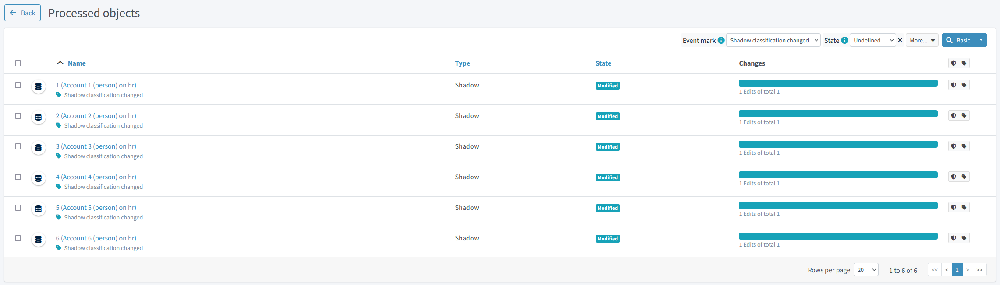

= Simple Simulation Tutorial
:page-toc: top
:page-since: "4.7"
:page-upkeep-status: green

This is a simple tutorial describing the new xref:/midpoint/reference/simulation/[simulations] feature.

NOTE: The reader is expected to have reasonable knowledge of midPoint; we don't describe individual steps in much detail here.

NOTE: The simulations feature requires midPoint 4.7 or later, and the native (PostgreSQL-based) repository.

The overall scenario is that we connect HR system - represented by a CSV file - to midPoint.
Then, we will connect the target system, represented again by a CSV file.

Source files for this tutorial are in link:https://github.com/Evolveum/midpoint-samples/tree/master/samples/simulation/tutorial[midPoint samples] repository.

== Connecting the Source (HR) System

=== Step HR-1: Viewing the Raw HR Data

. Create a directory for CSV files (like `~/sim-tutorial`) and copy the link:https://github.com/Evolveum/midpoint-samples/simulation/tutorial/hr.csv[HR CSV file] there.
. Check that the `filePath` in link:https://github.com/Evolveum/midpoint-samples/tree/master/samples/simulation/tutorial/resource-hr-1.xml[HR definition #1] matches the location of the copied HR CSV file.
. Import the HR definition #1 into midPoint.
Note that the lifecycle state of the resource is `proposed`, so the whole resource definition is in the development mode.
+
.Listing 1: The resource definition #1
[source,xml]
----
<resource oid="236dd5ca-47df-403c-82e1-9ce2f36be000">
    <name>hr</name>
    <lifecycleState>proposed</lifecycleState>
    <connectorRef type="ConnectorType"> ... </connectorRef>
    <connectorConfiguration> ... </connectorConfiguration>
</resource>
----

. List the accounts on the resource.
You should see something like this:
+
.Content of the HR resource
image::unclassified-accounts.png[Content of the HR resource]

Note that the accounts are not classified: their intent is `unknown`.

=== Step HR-2: Definition of an Object Type

The initial definition contains no object types.
So, let us define one.
Please import link:https://github.com/Evolveum/midpoint-samples/tree/master/samples/simulation/tutorial/resource-hr-2.xml[HR definition #2].
(Do not forget to check the CSV file location, as usual).

.Listing 2: The resource definition #2
[source,xml]
----
<resource oid="236dd5ca-47df-403c-82e1-9ce2f36be000">
    <name>hr</name>
    <lifecycleState>proposed</lifecycleState>
    <connectorRef type="ConnectorType"> ... </connectorRef>
    <connectorConfiguration> ... </connectorConfiguration>
    <schemaHandling>
        <objectType>
            <kind>account</kind>
            <intent>default</intent>
            <default>true</default>
            <delineation>
                <objectClass>ri:AccountObjectClass</objectClass>
            </delineation>
        </objectType>
    </schemaHandling>
</resource>
----

Now, list the accounts on the resource again.
You should see something like this:

.Content of HR resource with preliminary classification
image::accounts-intent-default.png[Content of HR resource with preliminary classification]

The intents were immediately set to `default`, because the accounts were not classified before.

=== Step HR-3: Change the Definition of the Object Type

Imagine we want to change the definition of the object type so that employees will have the intent of `person` instead of `default`.
Let us do that in link:https://github.com/Evolveum/midpoint-samples/tree/master/samples/simulation/tutorial/resource-hr-3.xml[HR definition #3].

.Listing 3: The resource definition #3
[source,xml]
----
<resource oid="236dd5ca-47df-403c-82e1-9ce2f36be000">
    <name>hr</name>
    <lifecycleState>proposed</lifecycleState>
    <connectorRef type="ConnectorType"> ... </connectorRef>
    <connectorConfiguration> ... </connectorConfiguration>
    <schemaHandling>
        <objectType>
            <kind>account</kind>
            <intent>person</intent>
            <default>true</default>
            <delineation>
                <objectClass>ri:AccountObjectClass</objectClass>
            </delineation>
        </objectType>
    </schemaHandling>
</resource>
----

Now, let us import the definition and check the accounts.
Their intents have not changed. #TODO check after GUI is updated#
Why?
Because - by default - the GUI does not engage the development configuration when listing the content of a resource.

To re-classify the accounts from `default` to `person` we have two options:

. Delete the shadows and let midPoint re-create them.
(This was the only option before version 4.7.)
. Read the content of the resource in simulation mode with development configuration enabled.
This is currently doable using synchronization (e.g. import) tasks. Here are two alternatives:
a. Execute the re-classification directly.
b. Simulate the re-classification.
Unlike the standard simulation, this is a special low-level simulation that captures assumed changes on shadow objects.
In 4.7, it is an xref:/midpoint/versioning/experimental/[experimental functionality].

Let us go through options 2b and 2a now.

==== Simulation of Re-classification Process (experimental functionality)

++++

++++

===== Running the Simulation

Import the following link:https://github.com/Evolveum/midpoint-samples/tree/master/samples/simulation/tutorial/task-hr-import-shadow-management-simulation.xml[task]:

.Listing 4: A task that simulates the accounts re-classification
[source,xml]
----
<task xmlns="http://midpoint.evolveum.com/xml/ns/public/common/common-3"
      xmlns:ri="http://midpoint.evolveum.com/xml/ns/public/resource/instance-3"
      oid="e44cd468-70e0-44b4-a25e-c26ccfdfb33d">
    <name>hr-import (shadow management simulation)</name>
    <executionState>runnable</executionState>
    <activity>
        <work>
            <import>
                <resourceObjects>
                    <resourceRef oid="236dd5ca-47df-403c-82e1-9ce2f36be000"/>
                    <objectclass>ri:AccountObjectClass</objectclass>
                </resourceObjects>
            </import>
        </work>
        <executionMode>shadowManagementPreview</executionMode> <!--1-->
        <execution>
            <configurationToUse>
                <productionConfiguration>false</productionConfiguration> <!--2-->
            </configurationToUse>
            <createSimulationResult>true</createSimulationResult> <!--3-->
        </execution>
        <!-- new style -->
        <execution>
            <mode>shadowManagementPreview</mode> <!--1-->
            <configurationToUse>
                <set>development</set> <!--2-->
            </configurationToUse>
        </execution>
        <reporting>
            <simulationResult> <!--3-->
                <create>true</create> <!--3-->
                <!-- OR -->
                <definition/> <!-- SimulationDefinitionType -> SimulationResultDefinitionType? -->
                <!-- OR -->
                <!-- not specifying anything here; the mere presence of "simulationResult" enables its creation -->
            </simulationResult>
        </reporting>
    </activity>
</task>
----
<1> Selects the (experimental) low-level simulation that captures changes to the shadows during classification and correlation.
<2> Instructs midPoint to use development configuration, not the production one.
<3> Enables the creation of the simulation result object.
Without this option, the simulation would run, but its results would not be captured.

===== Viewing the Results

After running this task, the classification of the shadows will _not_ change, but a new simulation result is created.
It looks like this:

.Simulation result capturing the shadows reclassification
image::result-after-reclassification.png[Simulation result capturing the shadows reclassification]

We see that the classification of both shadows would be changed.
We can look at the details by clicking on "Shadow classification changed" mark, and then on a shadow:

.Reclassified objects

.Reclassified object details
image::result-after-reclassification-details-2.png[Reclassified object details]

===== Creating a Report

The results can be also exported into CSV, by running a report named _Simulation report: Items changed_, with the following parameters:

[%autowidth]
[%heading]
|===
| Parameter | Value | Description
| `simulationResultRef` | choose the simulation result |
| `pathsIncluded` | `intent` | to avoid showing other changes, e.g. those of synchronization timestamps
| `showIfNoDetails` | `false` | to show only the really changed values
|===

#TODO fix the report to provide reasonable labels for parameters#

(The preview in GUI does not work with these kinds of reports. You have to execute the report to create the CSV file.)

After opening the CSV in the spreadsheet and hiding unimportant columns it will look like this:

.Reclassified objects report

==== Running the Re-classification

After we are satisfied with the expected re-classification results, we can run the re-classification in real.

Import the following link:https://github.com/Evolveum/midpoint-samples/tree/master/samples/simulation/tutorial/task-hr-import-full-simulation-no-result.xml[task]: #TODO add to samples#

.Listing 5: A task that executes the accounts re-classification
[source,xml]
----
<task xmlns="http://midpoint.evolveum.com/xml/ns/public/common/common-3"
      xmlns:ri="http://midpoint.evolveum.com/xml/ns/public/resource/instance-3"
      oid="8b169df3-3124-4e36-871f-83bb52acfd7b">
    <name>hr-import (full simulation, no result)</name>
    <executionState>runnable</executionState>
    <activity>
        <work>
            <import>
                <resourceObjects>
                    <resourceRef oid="236dd5ca-47df-403c-82e1-9ce2f36be000"/>
                    <objectclass>ri:AccountObjectClass</objectclass>
                </resourceObjects>
            </import>
        </work>
        <executionMode>preview</executionMode> <!--1-->
        <execution>
            <configurationToUse>
                <productionConfiguration>false</productionConfiguration>
            </configurationToUse>
        </execution>
        <!-- OR -->
        <execution>
            <mode>preview</mode> <!--1-->
            <configurationToUse>
                <set>development</set>
            </configurationToUse>
        </execution>
    </activity>
</task>
----
<1> This is the "main" (full) simulation.
The low-level operations on shadows (classification, correlation state determination) are carried out.
Changes to focus objects and resource objects are not executed.

After running the task and listing the accounts, we see their intent was changed to `person`.

.Content of HR resource after re-classification

As an exercise, you can try running the simulated reclassification task again and check there are no simulated re-classification now.

=== Step HR-4: Simulation of Inbound Mappings

So we can assume the resource object classification is OK now.
Let us prepare some inbound mappings and synchronization reactions.
Please import link:https://github.com/Evolveum/midpoint-samples/tree/master/samples/simulation/tutorial/resource-hr-4.xml[HR definition #4].

.Listing 6: The resource definition #4 - with mappings and reactions
[source,xml]
----
<resource oid="236dd5ca-47df-403c-82e1-9ce2f36be000">
    <name>hr</name>
    <lifecycleState>proposed</lifecycleState>
    <connectorRef> ... </connectorRef>
    <connectorConfiguration> ... </connectorConfiguration>
    <schemaHandling>
        <objectType>
            <kind>account</kind>
            <intent>person</intent>
            <default>true</default>
            <delineation>
                <objectClass>ri:AccountObjectClass</objectClass>
            </delineation>
            <attribute>
                <ref>ri:ident</ref>
                <inbound>
                    <strength>strong</strength>
                    <target>
                        <path>name</path>
                    </target>
                </inbound>
                <inbound>
                    <strength>strong</strength>
                    <target>
                        <path>employeeNumber</path>
                    </target>
                </inbound>
            </attribute>
            <attribute>
                <ref>ri:firstname</ref>
                <inbound>
                    <strength>strong</strength>
                    <target>
                        <path>givenName</path>
                    </target>
                </inbound>
            </attribute>
            <attribute>
                <ref>ri:lastname</ref>
                <inbound>
                    <strength>strong</strength>
                    <target>
                        <path>familyName</path>
                    </target>
                </inbound>
            </attribute>
            <attribute>
                <ref>ri:email</ref>
                <inbound>
                    <strength>strong</strength>
                    <target>
                        <path>emailAddress</path>
                    </target>
                </inbound>
            </attribute>
            <synchronization>
                <reaction>
                    <situation>linked</situation>
                    <actions>
                        <synchronize/>
                    </actions>
                </reaction>
                <reaction>
                    <situation>deleted</situation>
                    <actions>
                        <unlink/>
                    </actions>
                </reaction>
                <reaction>
                    <situation>unmatched</situation>
                    <actions>
                        <addFocus/>
                    </actions>
                </reaction>
            </synchronization>
        </objectType>
    </schemaHandling>
</resource>
----

Traditional import from GUI does nothing, because it simply does not "see" the resource configuration:
just as if there were no mappings nor synchronization reactions defined.

There is a possibility to preview (simulate) the import.
But be sure to check the preview that uses the development configuration, otherwise there will be no effects at all.

#TODO describe it here#

To simulate the execution of mappings in background task, let us import the link:https://github.com/Evolveum/midpoint-samples/tree/master/samples/simulation/tutorial/task-hr-import-full-simulation.xml[full simulation task].

After looking at the simulation result, we should see "2 focus activations" and after clicking on that mark, we will see users that are going to be added.
After displaying the details of the first of them, we see the following:

.Preview of the first user added

We see that our mappings work correctly.

=== Step HR-5: Switching the Resource into Production

Now we can change the lifecycle state of the resource to `active`, making it part of the production configuration.
After that, we can run the link:https://github.com/Evolveum/midpoint-samples/tree/master/samples/simulation/tutorial/task-hr-import.xml[regular HR import task].

We observe that two users were added.

We may now run the simulated import and check that there are no computed changes.

.Four unmodified objects

=== Step HR-6: Extending the Resource

Len us imagine that we want to add a mapping for `telephoneNumber`.
Usually, we cannot put the whole resource back into development mode.
However, we can do that for the particular mapping.

Please import link:https://github.com/Evolveum/midpoint-samples/tree/master/samples/simulation/tutorial/resource-hr-5.xml[HR definition #5].

.Listing 7: New mapping, in development mode
[source,xml]
----
<resource oid="236dd5ca-47df-403c-82e1-9ce2f36be000">
    <name>hr</name>
    <lifecycleState>active</lifecycleState> <!--1-->
    <connectorRef> ... </connectorRef>
    <connectorConfiguration> ... </connectorConfiguration>
    <schemaHandling>
        <objectType>
            <kind>account</kind>
            <intent>person</intent>
            <default>true</default>
            <delineation>
                <objectClass>ri:AccountObjectClass</objectClass>
            </delineation>
            <attribute>
                <ref>ri:phone</ref>
                <inbound>
                    <lifecycleState>proposed</lifecycleState> <!--2-->
                    <strength>strong</strength>
                    <target>
                        <path>telephoneNumber</path>
                    </target>
                </inbound>
            </attribute>
            <synchronization> ... </synchronization>
        </objectType>
    </schemaHandling>
</resource>
----
<1> The resource as such is in production mode.
<2> This particular mapping is visible only in the development mode.

After running the (full) simulation of import from HR, the result contains two deltas like this:

.Telephone number change

After we are satisfied with the mapping, we can put it into production mode (`lifecycleState` = `active`) and run the import task in "persistent-effects" mode.

== Connecting the Target System (Simulation of LDAP)

Now, let us connect a sample target system.
Typically, this would be an LDAP (AD) one.
For simplicity, let us use a CSV resource instead.

=== Step LDAP-1: Viewing the Raw LDAP Data

. Copy the link:https://github.com/Evolveum/midpoint-samples/simulation/tutorial/ldap.csv[LDAP CSV file] to the directory for CSV files for this tutorial (e.g. `~/sim-tutorial`).
. Check that the `filePath` in link:https://github.com/Evolveum/midpoint-samples/tree/master/samples/simulation/tutorial/resource-ldap-1.xml[LDAP definition #1] matches the location of the copied LDAP CSV file.
. Import the LDAP definition #1 into midPoint.
Note that the lifecycle state of the resource is `proposed`, so the whole resource definition is in the development mode.
+
.Listing 8: The LDAP resource definition #1 (simulated by a CSV file)
[source,xml]
----
<resource oid="80d0e843-906a-4bbe-b237-bd3568ec4169">
    <name>ldap</name>
    <lifecycleState>proposed</lifecycleState>
    <connectorRef type="ConnectorType"> ... </connectorRef>
    <connectorConfiguration> ... </connectorConfiguration>
</resource>
----

. List the accounts on the resource.
You should see something like this:
+
.Content of the LDAP resource
image::unclassified-accounts-ldap.png[Content of the LDAP resource]
#TODO FIX#

Note that the accounts are not classified: their intent is `unknown`.

=== Step LDAP-2: Definition of an Object Type

The initial definition contains no object types.
So, let us define one.
Please import link:https://github.com/Evolveum/midpoint-samples/tree/master/samples/simulation/tutorial/resource-ldap-2.xml[LDAP definition #2].

.Listing 9: The LDAP resource definition #2
[source,xml]
----
<resource oid="80d0e843-906a-4bbe-b237-bd3568ec4169">
    <name>ldap</name>
    <lifecycleState>proposed</lifecycleState>
    <connectorRef type="ConnectorType"> ... </connectorRef>
    <connectorConfiguration> ... </connectorConfiguration>
    <schemaHandling>
        <objectType>
            <kind>account</kind>
            <intent>default</intent>
            <default>true</default>
            <delineation>
                <!-- Would be inetOrgPerson on real LDAP -->
                <objectClass>ri:AccountObjectClass</objectClass>
            </delineation>
        </objectType>
    </schemaHandling>
</resource>
----

Now, list the accounts on the resource again.
You should see something like this:
+
.Content of LDAP resource with classification
image::accounts-intent-default-ldap.png[Content of LDAP resource with classification]

#TODO fix#

The intents were immediately set to `default`, because the accounts were not classified before.

Let us assume we are satisfied with this.
If we would not be, we could fine-tune the classification just like in <<Step HR-3: Change the Definition of the Object Type>>.

Now let us start correlating the accounts.

=== Step LDAP-3: Definition of an Object Type
