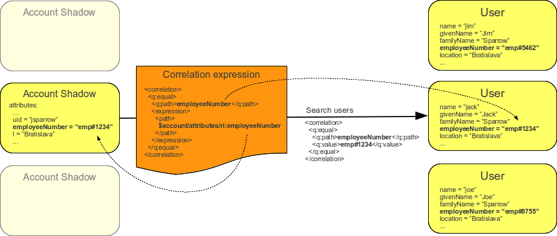
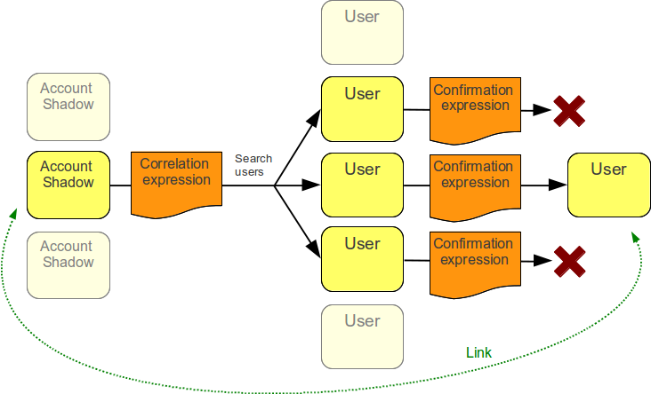

= Correlation and Confirmation Expressions
:page-wiki-name: Correlation and Confirmation Expressions
:page-wiki-id: 4423971
:page-wiki-metadata-create-user: semancik
:page-wiki-metadata-create-date: 2012-06-07T17:09:24.531+02:00
:page-wiki-metadata-modify-user: semancik
:page-wiki-metadata-modify-date: 2012-11-26T15:27:58.648+01:00
:page-upkeep-status: orange

xref:/midpoint/reference/synchronization/introduction/[Synchronization] mechanism makes sure that the state of accounts corresponds to the state of the user that owns them with respect to the configured policies.
For this to work properly there needs to be a way how to set which user owns which account.
Account xref:/midpoint/reference/roles-policies/roles/assignment/assigning-vs-linking/[linking] is used as a primary mechanisms for this.
The links are created automatically when account is created as a consequence of user modification (e.g. a role is xref:/midpoint/reference/roles-policies/roles/assignment/[assigned] to the user).

However, there may be accounts that existed before the IDM solution was deployed.
Or there may be accounts that were created outside midPoint.
It is possible to manage these accounts manually by linking them to corresponding users.
But this solution does not scale and is not efficient.
Therefore midPoint has a mechanism how to correlate users and accounts automatically.

Correlation and confirmation expressions are used to find an owner for an account.
It is important to remember that these expressions always work by having a fixed account and searching for an owner (user).
This is the usual case in synchronization.
The expressions are not designed to work the other way around.

== Correlation Expression

The goal of correlation expression is to (quickly and efficiently) find a list of candidate owners.
Correlation expression takes information from the account and constructs a search query.
This query is then used to locate account owner.
Following diagram illustrates the use of correlation expression to correlate accounts and users by `employeeNumber` attribute.
In this case the value of account attribute `employeeNumber` is used to construct a query that is looking for all the users that have a specific value in the `employeeNumber` user property.
Therefore it can overcome the ambiguity of account username `jsparrow` by using a more reliable correlation identifier (`employeeNumber`).

Correlation expression is in fact just a (parametric) search query, i.e. correlation expression is just a xref:/midpoint/reference/concepts/query/xml-query-language/[search filter] with an xref:/midpoint/reference/expressions/expressions/[expression] inside.
See xref:/midpoint/reference/concepts/query/xml-query-language/[XML Object Query] page for more details.

If correlation expression matches no user then it is assumed that the account has no owner.
If correlation expression matches one or more accounts then a confirmation expression is used.

== Confirmation Expression

Confirmation is a second optional step.
If confirmation expression is present it will be executed for every user that is a result of a correlation search.
The responsibility of confirmation expression is to compare account and the candidate user.
If the account should belong to the user then the confirmation returns `true` value.
If it does not then it returns `false`. Simplified illustration of the use of correlation and confirmation expressions is provided in the next diagram.

Confirmation step is optional.
If confirmation expression is not present then it is assumed that it would return `true` for every account-user combination.

== Correlation, Confirmation and Synchronization Situations

The result of correlation and confirmation expression does not directly means linking of the account and the user.
The result simply determines xref:/midpoint/reference/synchronization/situations/[synchronization situation] of the account.
The synchronization policy determines what will be the actual reaction.
The combined correlation and confirmation expression should return `true` for at most one user.
That will result in `unlinked`xref:/midpoint/reference/synchronization/situations/[synchronization situation]. The usual reaction to this situation is that such user and the account will be xref:/midpoint/reference/roles-policies/roles/assignment/assigning-vs-linking/[linked]. However that may not necessarily be the case.
Following table summarizes the resulting situation with respect to the number of correlation/confirmation results.

[%autowidth]
|===
|  Number of users after correlation/confirmation  |  Synchronization situation

|  0
| `unmatched`

|  1
| `unlinked`

|  more than 1
| `disputed`

|===

The correlation and confirmation expressions are *not* used for accounts that are already linked to a user.
In such case the link is assumed to be authoritative and this situation is resolved as `linked`.