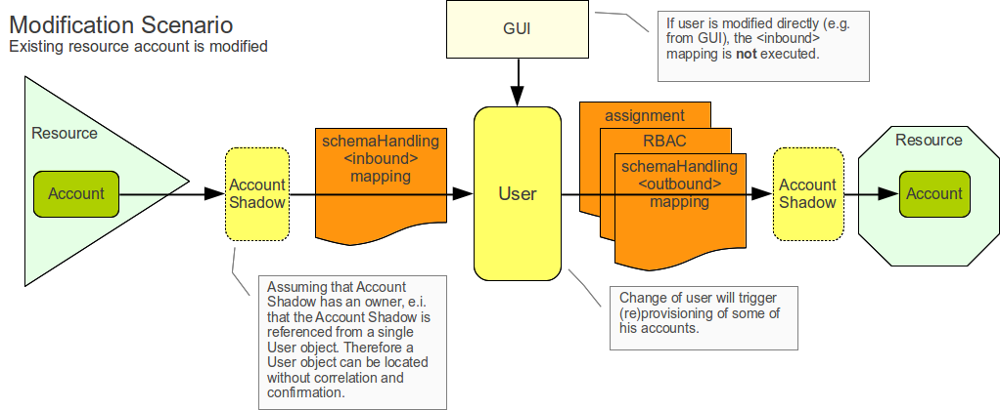
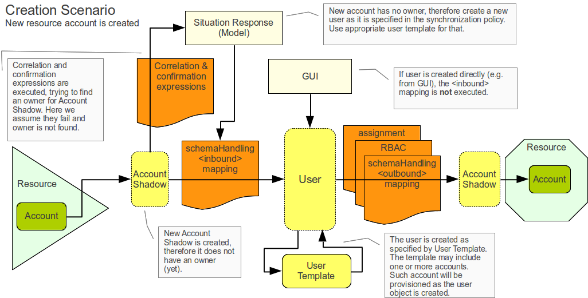

= Synchronization Examples
:page-nav-title: Examples
:page-wiki-name: Synchronization Examples
:page-wiki-id: 655441
:page-wiki-metadata-create-user: semancik
:page-wiki-metadata-create-date: 2011-04-29T12:27:03.203+02:00
:page-wiki-metadata-modify-user: semancik
:page-wiki-metadata-modify-date: 2018-04-27T17:01:28.813+02:00
:page-toc: top
:page-upkeep-status: orange

== Introduction

The purpose of Synchronization functionality in midPoint is keep the data in the Resources and the midPoint repository synchronized.
That may not necessarily mean the data needs to be the same.
By "synchronized" we mean that the data should be as complete and up-to-date as possible and should not be contradictory.
The data format and attribute meaning will vary from resource to resource, therefore midPoint cannot just blindly copy the data.
Transformation and business rules must be applied to data as they pass in and out of midPoint.

By _synchronization_ we mean quite a wide collection of mechanisms ranging from near-real-time process (_live synchronization_) to a scheduled batch processes (_reconciliation_). All such mechanisms are following the same principles and are using the same set of policies (configuration).

== Example: Modification Scenario

The best way to describe synchronization is to illustrate it using an example.

First example assumes that there is already a user in the midPoint and the user has two accounts.
One of the accounts is changed and the change needs to be propagated to the other account.
The example is illustrated in the figure below.

The change to the first account is detected by the live synchronization or reconciliation logic of midPoint.
The method of change detection does not really matter.
As the change is detected, the provisioning component makes sure the corresponding xref:/midpoint/architecture/archive/data-model/midpoint-common-schema/[AccountShadow] object is updated in midPoint repository (see xref:/midpoint/reference/schema/common-data-model/[Common Data Model]). Account Shadow usually contains only identifiers and therefore it should be already up-to-date in this case.

The following XML snippet contains the Account Shadow object as it was stored in the midPoint repository before the change was detected.
You can see that there are only identifiers, no data.

.Account Shadow
[source,xml]
----
<account oid="c0c010c0-d34d-b33f-f00d-222111111111">
        <name>jack</name>
        <resourceRef oid="c0c010c0-d34d-b33f-f00d-333111111111" type="ResourceType"/>
        <objectClass>ri:AccountObjectClass</objectClass>
        <attributes>
            <icfs:uid>12345678-d34d-b33f-f00d-999888777666</icfs:uid>
            <icfs:name>uid=jack,ou=people,dc=example,dc=com</icfs:name>
        </attributes>
</account>

----

The synchronization logic in the xref:/midpoint/architecture/archive/subsystems/provisioning/[provisioning subsystem] will issue a change notification that is picked up by the xref:/midpoint/architecture/archive/subsystems/model/[IDM model]. IDM model will try to figure out what's going on (so called _xref:/midpoint/reference/synchronization/situations/[situation]_, it is described in the second example below).
In this case it simply means that the IDM model will check if the account has an _owner_, that means whether it is already xref:/midpoint/reference/roles-policies/roles/assignment/assigning-vs-linking/[linked to a user]. This example assumes that it has an owner, so locating appropriate user object is straightforward.

Following XML snippet shows a user object.
It can be seen that there is appropriate `linkRef` (in 2.1.x versions `accountRef` is used instead) that points to the account shadow object provided above.
Please also note the full name of the user is `Jack Sparrow`.

.User
[source,xml]
----
<user oid="c0c010c0-d34d-b33f-f00d-111111111111">
    <name>jack</name>
    <fullName>Jack Sparrow</fullName>
    <givenName>Jack</givenName>
    <familyName>Sparrow</familyName>
    ...
    <linkRef oid="c0c010c0-d34d-b33f-f00d-222111111111"/>
    <linkRef oid="c0c010c0-d34d-b33f-f00d-222111111112"/>
</user>

----

The IDM model logic needs to map changes in an account to the changes to a user.
The `schemaHandling` part of the resource definition is used for that.
The schema handling contains supplementary definition how to handle each of the account attributes.
That definition may also contain xref:/midpoint/reference/expressions/mappings/inbound-mapping/[inbound mapping] that define how to handle change of the attribute and propagate it within midPoint.

The following XML snippet describes the `schemaHandling` part of the Resource where the change originated.
It describes a default account type for the resource.
The account type refers to the resource schema (the `schema` part), where appropriate XSD type is defined.
This part defines capabilities of the Resource and connector.
MidPoint can influence that only slightly.
The way midPoint handles the attributes is described in the `schemaHandling` part.
Some of the attributes are described here in more details, including `inbound` and `outbound` mappings.

Please note the `schemaHandling` definition of attribute `ri:cn`. It defines an xref:/midpoint/reference/expressions/mappings/inbound-mapping/[inbound mapping] telling midPoint to copy the value of this attribute to the `fullName` property of User object.

.Schema Handling
[source,xml]
----
<resource oid="c0c010c0-d34d-b33f-f00d-333111111111">
    <name>OpenDJ LDAP directory</name>
    ...
    <schema>
        <!-- XSD part specifying the ri:AccountObjectClass type goes here -->
    </schema>
    <schemaHandling>
        <accountType>
            <name>Default Account</name>
            <default>true</default>
            <objectClass>ri:AccountObjectClass</objectClass>
            <attribute>
                <ref>icfs:name</ref>
                <displayName>Distinguished Name</displayName>
                <outbound>
                    <strength>weak</strength>
                    <source>
                        <path>$user/name</path>
                    </source>
                    <expression>
                        
                    </expression>
                </outbound>
            </attribute>
            <attribute>
                 <ref>icfs:uid</ref>
                 <displayName>Entry UUID</displayName>
                 <access>read</access>
            </attribute>
            <attribute>
                 <ref>ri:cn</ref>
                 <displayName>Common Name</displayName>
                 <outbound>
                     <source>
                         <path>$user/fullName</path>
                     </source>
                 </outbound>
                 <inbound>
                     <target>
                         <path>$user/fullName</path>
                     </target>
                 </inbound>
                </attribute>
                <attribute>
                    <ref>ri:description</ref>
                    <outbound>
                        <expression>
                            <value>Created by IDM</value>
                        </expression>
                    </outbound>
                </attribute>
            </accountType>
    </schemaHandling>
    ...
</resource>

----

As the model is processing the change notification it encounters the change of `ri:cn` attribute.
It looks into the `schemaHandling` definition for that attribute and finds out the value of that attribute should be copied to the `fullName` property of user.
So model transforms the modification of account attribute `cn` to the modification of user attribute `fullName`. Model applies the modification to the user object resulting in the following state of the user:

.User
[source,xml]
----
<user oid="c0c010c0-d34d-b33f-f00d-111111111111">
    <name>jack</name>
    <fullName>cpt. Jack Sparrow</fullName>
    <givenName>Jack</givenName>
    <familyName>Sparrow</familyName>
    ...
    <linkRef oid="c0c010c0-d34d-b33f-f00d-222111111111"/>
    <linkRef oid="c0c010c0-d34d-b33f-f00d-222111111112"/>
</user>

----

After applying the change to the user midPoint behaves exactly as if the user was modified from any other source.
This means midPoint will try to apply (provision) user changes to all user's accounts.
Therefore midPoint takes user's other account (which is an AD account in this case), fetch definition of AD resource and looks into the `schemaHandling` section.
But this time it looks for xref:/midpoint/reference/expressions/mappings/outbound-mapping/[outbound expressions]. The resource definition for the AD resource looks like this:

.Schema Handling
[source,xml]
----
<resource oid="c0c010c0-d34d-b33f-f00d-333111111112">
    <name>MyLittleAD</name>
    ...
    <schema>
        <!-- XSD part specifying the ad:AccountObjectClass type goes here -->
    </schema>
    <schemaHanling>
        <accountType>
            <name>Default Account</name>
            <default>true</default>
            <objectClass>ri:AccountObjectClass</objectClass>
            <attribute>
                <ref>icfs:name</ref>
                <displayName>Distinguished Name</displayName>
                <outbound>
                    <strength>weak</strength>
                    <source>
                        <path>$user/name</path>
                    </source>
                    <expression>
                        
                    </expression>
                </outbound>
            </attribute>
            <attribute>
                 <ref>icfs:uid</ref>
                 <displayName>Entry UUID</displayName>
                 <access>read</access>
            </attribute>
            <attribute>
                 <ref>ri:cn</ref>
                 <displayName>Common Name</displayName>
                 <outbound>
                     <source>
                         <path>$user/fullName</path>
                     </source>
                 </outbound>
                 <inbound>
                     <target>
                         <path>$user/fullName</path>
                     </target>
                 </inbound>
            </attribute>
            <attribute>
                 <ref>ri:givenName</ref>
                 <displayName>First Name</displayName>
                 <outbound>
                     <source>
                         <path>$user/givenName</path>
                     </source>
                 </outbound>
                 <inbound>
                     <target>
                         <path>$user/givenName</path>
                     </target>
                 </inbound>
            </attribute>
            <attribute>
                 <ref>ri:sn</ref>
                 <displayName>Last Name</displayName>
                 <outbound>
                     <source>
                         <path>$user/familyName</path>
                     </source>
                 </outbound>
                 <inbound>
                     <target>
                         <path>$user/familyName</path>
                     </target>
                 </inbound>
            </attribute>
        </accountType>
    </schemaHandling>
    ...
</resource>

----

This pre-populates the user entry.
However, this may not populate all the properties of user entry.
Therefore additional mechanisms are needed to make the new user look as required.
The mechanism is called xref:/midpoint/architecture/archive/subsystems/model/user-synchronizer/[User Synchronizer] and it is actually the same mechanism that is invoked for any other change, e.g. when a user is created from the GUI.

First step in processing of a new user is application of User Template.
User template is a set of expressions that can be used to automatically construct a new user object and to keep it consistent through its lifetime.
It contains expressions that define how to set the properties of a user object.
An example is provided below.

.User Template
[source,xml]
----
<objectTemplate oid="c0c010c0-d34d-b33f-f00d-777111111111">
    <name>Default User Template</name>
    <mapping>
        <strength>weak</strength>
        <source>
            <path>givenName</path>
        </source>
        <source>
            <path>familyName</path>
        </source>
        <expression>
            
        </expression>
        <target>
            <path>fullName</path>
        </target>
    </mapping>
    <mapping>
        <strength>weak</strength>
        <expression>
            <value>
                <assignment>
                    <accountConstruction>
                        <resourceRef oid="c0c010c0-d34d-b33f-f00d-333111111112" type="c:ResourceType"/>
                    </accountConstruction>
                </assignment>
            </value>
        </expression>
        <target>
            <path>assignment</path>
        </target>
    </mapping>
</objectTemplate>

----

The user template specifies that the `fullName` has to be constructed by executing an xref:/midpoint/reference/expressions/expressions/script/groovy/[Groovy script expression] that will concatenate the `givenName` and `familyName` properties.
That mapping is marked as `weak` therefore it will be executed only if the `fullName` does not have a value.
Therefore this mapping will not be applied in our case, as the `fullName` attribute will be populated from the account using an `inbound` mapping in `schemaHandling`.

More important aspect of the user template example above is the construction of an account assignment.
The template specifies that the user should have an xref:/midpoint/reference/roles-policies/roles/assignment/[assignment]. The assignment assigns an account to the user.
Therefore an account on the resource identified by OID `c0c010c0-d34d-b33f-f00d-333111111112` is assigned to the user and will be provisioned to he user.
The `outbound` mapping of the `schemaHandling` part of the Resource definition will be used to set parameters for this account.

The model subsystem them modifies user according to the user template.
It also computes that the user should have and account and also the attributes for that account (using outbound expressions).
New user object is then created in midPoint repository and also the appropriate account is created for the user.
This situation is similar to the one described in the previous example.

== RBAC

xref:/midpoint/reference/roles-policies/roles/rbac/[Role-based access control] gets processed in the _outbound_ phase.
The mappings in roles are processed similarly to the outbound mappings and at almost the same time.
Similar principles that apply to outbound mappings apply to roles as well.

== Synchronization Flavors

There are four basic synchronization flavors:

* *Provisioning synchronization*: distributing changes to accounts during ordinary provisioning.

* *Live synchronization*: almost-realtime detection and reaction to changes.

* *Reconciliation*: scheduled batch check of data consistency.

* *Discovery*: Opportunistic reaction to a change discovered during an unrelated operation.

See xref:/midpoint/reference/synchronization/flavors/[Synchronization Flavors] page for more details.

== See Also

* xref:/midpoint/reference/synchronization/introduction/[Synchronization]

* xref:/midpoint/reference/synchronization/situations/[Synchronization Situations]

* xref:/midpoint/reference/synchronization/flavors/[Synchronization Flavors]

* xref:/midpoint/reference/schema/[Data Model]

* link:https://svn.evolveum.com/midpoint/trunk/infra/schema/src/main/resources/xml/ns/public/common/common-1.xsd[Common XSD Schema] has a lot of in-line documentation.

* xref:/midpoint/reference/expressions/[Mappings and Expressions]

* xref:/midpoint/reference/concepts/query/xml-query-language/[XML Object Query]

* xref:/midpoint/architecture/archive/subsystems/model/user-synchronizer/[User Synchronizer]