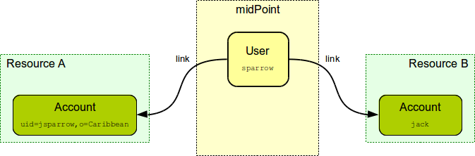
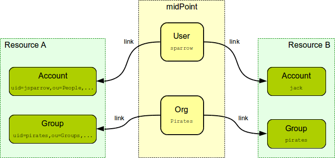

= Generic Synchronization
:page-wiki-name: Generic Synchronization
:page-wiki-id: 13598744
:page-wiki-metadata-create-user: semancik
:page-wiki-metadata-create-date: 2014-01-07T14:08:05.801+01:00
:page-wiki-metadata-modify-user: semancik
:page-wiki-metadata-modify-date: 2014-04-02T10:50:42.822+02:00
:page-upkeep-status: orange
:page-upkeep-note: Probably just minor updates needed.

== Identity Synchronization

Most traditional provisioning systems are limited to synchronization of users and accounts.
It makes perfect sense because this is what Identity Management is mostly about.
And this is also the way that early IDM systems (including early midpoint versions) supported.

== Generic Synchronization

The world has moved on and the capabilities of traditional Identity Management systems are not longer sufficient.
Recent IDM deployments require ability to synchronize groups to roles, organizational units to groups, roles to ACLs and so on.
Simply speaking the current IDM deployments require much more _generic_ synchronization capabilities.

The midPoint development team anticipated this very early in the midPoint development process.
Therefore midPoint architecture was designed to support much broader set of synchronization options than just user-account pair.
However as we try really hard to keep midPoint development pragmatic we have started to develop and test midPoint on user-account pair.
When we were happy with the code structure and stability of this synchronization mechanisms we have extended the mechanism to be much more generic and to allow synchronization of a broader sets of objects.
And this is what we call "Generic Synchronization".

Generic synchronization applies the same synchronization principles to all object types.
The powerful features that midPoint already has for user-account synchronization can be also applied to other synchronization schemes.
The figure above shows the traditional way how accounts are linked to users.
Therefore if a user is modified the modifications can be propagated to accounts.
The same principle can also be used for other object types such as xref:/midpoint/reference/org/organizational-structure/[Orgs] (midPoint organizational units) and groups.
Groups can be linked to an Org in midPoint.
Therefore if the Org changes then the changes can be propagated to groups.
This feature allows to re-use all the usual midPoint capabilities for unusual situations.
E.g. groups can be automatically created based on organizational structure.
Such groups will correspond to departments, sections or projects.
The groups can automatically be deleted when an Org is gone (e.g. a project is closed) limiting a "dead weight" in the corporate directory.
The groups can also be synchronized with midPoint roles creating a access control structure consistent across the whole organization.
And actually the extremely poweful xref:/midpoint/reference/roles-policies/rbac/[RBAC] mechanism can also be reused for these unusual links creating a kind of meta-roles.
E.g. and Org itself can be assigned to a meta-role which defines in which systems the corresponding groups has to be created for this Org.
This simple mechanism is introducing a completely new dimension to midPoint RBAC structures.

== See Also

* xref:/midpoint/reference/resources/entitlements/[Entitlements]

* xref:/midpoint/reference/resources/resource-configuration/[Resource Configuration]

* xref:/midpoint/reference/synchronization/introduction/[Synchronization]

* xref:/midpoint/reference/resources/resource-configuration/#_correlation_and_synchronization[Correlation and Synchronization]

* xref:/midpoint/reference/resources/resource-configuration/schema-handling/#_synchronization[Synchronization Configuration]

* xref:/midpoint/reference/roles-policies/assignment/[Assignment]

* xref:/midpoint/reference/schema/focus-and-projections/[Focus and Projections]
