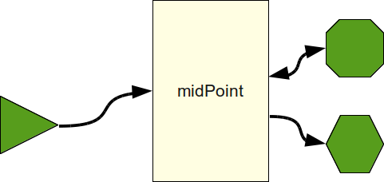
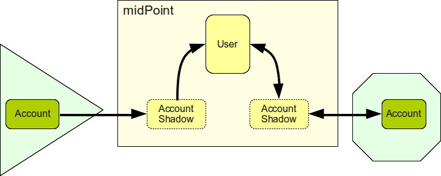

= MidPoint Synchronization Introduction
:page-nav-title: Introduction
:page-wiki-name: Synchronization
:page-wiki-id: 3571885
:page-wiki-metadata-create-user: semancik
:page-wiki-metadata-create-date: 2012-01-28T17:49:09.511+01:00
:page-wiki-metadata-modify-user: ppohja
:page-wiki-metadata-modify-date: 2015-12-21T13:15:52.390+01:00
:page-display-order: 20
:page-upkeep-status: orange
:page-midpoint-feature: true
:page-alias: { "parent" : "/midpoint/features/current/", "slug" : "synchronization", "title" : "Synchronization", "display-order" : 100 }

Synchronization is an umbrella term used to describe several related mechanism in midPoint.
All the synchronization mechanisms have the same goal: make sure that the information in midPoint and the real state of the resources is consistent.

== "Should Be" and "Is"

The repository of identity management system contains information about the state that _should be_: assigned resource accounts and roles, attribute values derived from user properties and so on.
However, the actual state of the accounts may be different.
Some accounts that should exist may not exist because the create operation has failed or someone deleted them.
The accounts may belong to wrong set of groups and may not be consistent with the IDM roles.
There may be accounts that belong to nobody or are otherwise "illegal".

Synchronization is aligning that state that _should be_ (assignments, roles, derived attributes) with that state that _is_ (real account attributes).
Synchronization is the heart of identity management system.

== User in the Center

The synchronization of several Resource accounts is always done indirectly, using the User object as an mid-point.
That means that the data are synchronized account-user, never account-account.
If a synchronization of two accounts is needed, it has to be done indirectly as account-user-account.
This approach limits the complexity of the synchronization using common data model of user as a mediation point.

The synchronization of account-user is bidirectional, however each direction is defined separately.
There is a set of _outbound_ synchronization policies that define how data are synchronized in direction _out of midPoint_, that means from the user to the account.
The _inbound_ policy defines how data are synchronized _into midPoint_, that means from account to the user.
Both outbound and inbound expressions are kept close to each other to better support consistency of the policies.

The reason for using the user object as a intermediary for all synchronization is to keep complexity under control.
User object provides a common data schema, a common _lingua franca_ that can be mapped to any type of resource.
This approach reduces the number of mappings that are needed to synchronize data in all resources.
The number of mappings in midPoint is proportional to the number of resources (O(n)) while the number of any-to-any mappings is proportional to the square of number of resources (O(n^2^)). The any-to-any mapping gets out of control very quickly.
Such mapping is usually very difficult to maintain for the number of resources as small as five, it is almost impossible to maintain if the number of resource is greater than ten.
The user-centric mapping in midPoint can easily handle mapping of tens of resources and mapping of hundreds of resources is still maintainable.
This is one of the ways how midPoint promotes good design of IDM deployments.

== Synchronization Happens All the Time

Synchronization happens every time when midPoint has a chance to synchronize something.
It happens when a change on resource is detected.
It happens when an administrator want to change a user or an account.
It happens when a difference between midPoint repository and resource is discovered during reconciliation.
It also happens if an unexpected error is detected (e.g. when an account that should exist is not found).
It happens all the time.
But regardless how is the change detected the reaction is always the same.
Synchronization policies apply to all flavors of synchronization.

== Synchronization Flavors

There are four basic synchronization flavors:

* *Provisioning synchronization*: distributing changes to accounts during ordinary provisioning.

* *Live synchronization*: almost-realtime detection and reaction to changes.

* *Reconciliation*: scheduled batch check of data consistency.

* *Discovery*: Opportunistic reaction to a change discovered during an unrelated operation.

See xref:/midpoint/reference/synchronization/flavors/[Synchronization Flavors] page for more details.

== Synchronization Policies

All flavors of synchronization share the same internal mechanisms (algorithm computing the values) and also the same policies.
This is a major benefit, as the system is much easier to consistently configure and maintain.
Unlike most IDM systems, there is no difference in setup of live sync, reconciliation and other synchronization flavors.
If really necessary, the policies can be configured individually for each mechanism.

The policy configuration is essentially just a set of defined reactions for each synchronization situation.

== See Also

* xref:/midpoint/reference/synchronization/examples/[Synchronization Examples]

* xref:/midpoint/reference/synchronization/flavors/[Synchronization Flavors]

* xref:/midpoint/reference/synchronization/situations/[Synchronization Situations]