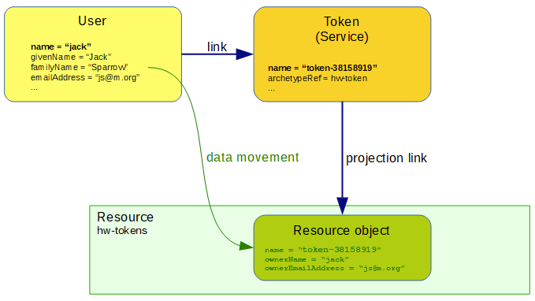

= Linked Objects Scenario 1: Hardware Tokens
:page-nav-title: Scenario 1: Hardware Tokens
:page-wiki-name: Linked objects scenario 1: Hardware tokens
:page-wiki-id: 52002920
:page-wiki-metadata-create-user: mederly
:page-wiki-metadata-create-date: 2020-06-01T17:13:24.555+02:00
:page-wiki-metadata-modify-user: mederly
:page-wiki-metadata-modify-date: 2020-06-02T12:11:48.000+02:00
:page-since: "4.2"
:page-experimental: true
:page-toc: top

== Overview

Let hardware tokens be represented in midPoint as services with an archetype of `hw-token`. Each token can have (zero or one) owner of `UserType` type.
The token is provisioned to `hw-tokens` resource.
As part of provisioning we have to set some attributes (owner's name and email address) from token owner to the target resource object.
The provisioning should work seamlessly even if these attributes change on the owning user; or even if the user is abruptly deleted.

== An implementation overview

The implementation has two parts:

. Implementing the data transfers as such.
This means that when we are processing a token we want to set correct `ownerName` and `ownerEmailAddress` value(s) on the corresponding resource object.
This is ensured by outbound mappings.

. Triggering the recomputation of token when the user changes.
Here we use policy rules.

== Data transfer implementation using mappings

This is done by these two mappings:

.Setting owner name and email address on a projection
[source,xml]
----
<attribute>
    <ref>ri:ownerName</ref>
    <tolerant>false</tolerant>
    <outbound>
        <strength>strong</strength>
        <expression>
            
        </expression>
    </outbound>
</attribute>
<attribute>
    <ref>ri:ownerEmailAddress</ref>
    <tolerant>false</tolerant>
    <outbound>
        <strength>strong</strength>
        <expression>
            
        </expression>
    </outbound>
</attribute>
----

== Triggering the recomputation

There are the following situations when the token should be recomputed:

[%autowidth]
|===
| # | Change | Comment

| 1
| Owner `name` or `emailAddress` is changed
| This is the simplest case.

| 2
| The link itself is changed
| We consider link to be changed if the `roleMembershipRef` value corresponding to the link is added or deleted.

| 3
| User is added (including the link)
| This is a special case of the above - a specific value of `roleMembershipRef` is added (along with the whole user object).

| 4
| User is deleted (had the link before)
| This is (again) a special case of the above - a specific value of `roleMembershipRef` is deleted (along with the whole user object).

|===

The situation #1 can be implemented using the policy rule induced from `hw-token` archetype to the owner of given token (i.e. using order=2 inducement):

.Recomputing token when user name or emailAddress changes
[source,xml]
----
<inducement>
    <policyRule>
        <name>recompute-hw-token-on-holder-change</name>
        <documentation>Recomputes a token when user's name or emailAddress changes.</documentation>
        <policyConstraints>
            <or>
                <modification>
                    <operation>modify</operation>
                    <item>name</item>
                </modification>
                <modification>
                    <operation>modify</operation>
                    <item>emailAddress</item>
                </modification>
            </or>
        </policyConstraints>
        <policyActions>
            <scriptExecution>
                <object>
                    <linkTarget>
                        <!-- i.e. all objects that brought this policy rule to the focus -->
                        <matchesRuleAssignment>true</matchesRuleAssignment>
                    </linkTarget>
                </object>
                <executeScript>
                    <s:recompute/>
                </executeScript>
            </scriptExecution>
        </policyActions>
    </policyRule>
    <order>2</order> <!-- assigned to the user -->
</inducement>

----

The `"object = linkTarget"` specification (new in 4.2) means "take all targets of all links and apply the script on them".
This is (almost) what we need.
The only drawback is that without further specification we would be going to recompute _all_ objects linked to the user, including e.g. its own archetype, other roles, orgs, and so on.

To prevent this, we include `matchesRuleAssignment` = `true` clause, described on xref:/midpoint/reference/synchronization/linked-objects/[Linked objects] page.
It should be understood like this: This policy rule came to the focus via some assignment (unless it's a global policy rule, which is not the case here).
It is the assignment of the token in question, because the token object itself has an archetype `hw-token` that induces this rule.
So the `matchesRuleAssignment` simply tells midPoint to recompute that one token.

Recomputation on membership change (covering situations #2-4 above, at least in theory) can be achieved like this:

.Recomputing devices when membership changes
[source,xml]
----
<policyRule>
    <policyConstraints>
        <alwaysTrue/>
    </policyConstraints>
    <policyActions>
        <scriptExecution>
            <object>
                <linkTarget>
                    <changeSituation>changed</changeSituation>
                    <matchesRuleAssignment>true</matchesRuleAssignment>
                </linkTarget>
            </object>
            <executeScript>
                <s:recompute/>
            </executeScript>
        </scriptExecution>
    </policyActions>
</policyRule>
----

The `alwaysTrue` experimental policy constraint is designed to trigger any time it is evaluated (in the context of object, not an assignment).
So this rule is really always triggered.

And what it does?
It takes all targets that match rule assignment (i.e. all tokens in this case) _and_ whose membership status changed.
This should cover situations #2, #3, and #4.

*(Temporary) workaround for situation #4:*
However, because assignment evaluator skips evaluating assignments when object is deleted, the respective policy rule must be attached to the object in some other way.

So this global policy rule has to be used:

.Recomputing devices on object delete
[source,xml]
----
<globalPolicyRule>
    <focusSelector>
        <type>UserType</type>
    </focusSelector>
    <policyConstraints>
        <modification>
            <operation>delete</operation>
        </modification>
    </policyConstraints>
    <policyActions>
        <scriptExecution>
            <object>
                <linkTarget>
                    <type>ServiceType</type>
                    <archetypeRef oid="21575364-d869-4b96-ac3f-b7b26e0e8540"/> <!-- hw-token -->
                </linkTarget>
            </object>
            <executeScript>
                <s:recompute/>
            </executeScript>
        </scriptExecution>
    </policyActions>
</globalPolicyRule>

----

We cannot use `matchesRuleAssignment` clause because there's no assignment here.
So we have to resort to explicit specification of the archetype.

Complete configuration for this scenario is in link:https://github.com/Evolveum/midpoint/tree/master/model/model-intest/src/test/resources/linked/hw-tokens[https://github.com/Evolveum/midpoint/tree/master/model/model-intest/src/test/resources/linked/hw-tokens] directory (and system configuration in the parent one).