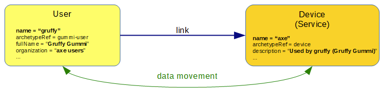

= Linked Objects Scenario 2: Devices Owned By Users
:page-nav-title: Scenario 2: Devices Owned By Users
:page-wiki-name: Linked objects scenario 2: Devices owned by users
:page-wiki-id: 52002879
:page-wiki-metadata-create-user: mederly
:page-wiki-metadata-create-date: 2020-05-21T10:33:55.623+02:00
:page-wiki-metadata-modify-user: mederly
:page-wiki-metadata-modify-date: 2020-06-02T11:19:17.563+02:00
:page-experimental: true
:page-toc: top

[WARNING]
====
This scenario uses unfinished/experimental xref:/midpoint/reference/synchronization/linked-objects/named-object-links/[named object links] feature.
It is very powerful but even more experimental than linked objects feature as a whole!
So beware, everything described here can change any time.
====

== Overview

Let us have a set of devices that have the following characteristics:

. A device is used by no one or a single user at any given time.

. The device gives its user some properties, namely user's `organization` obtains value of "D users" for any owned device D.

. On the other hand, the device knows who uses it by storing the owner `name` and `fullName` in its `description` property.

We want to make sure characteristics 2 and 3 hold also when ownership of the device changes and/or when relevant properties (owner `name` and `fullName` and device `name`) change.

== An implementation overview

The implementation has two parts:

. Implementing the data transfers as such.
This means that when we are processing a user (owner) we want to set correct `organization` value(s) on him.
And vice versa, when we are processing owned device, we want to set correct `description` based on owner's data.

. Triggering the recomputation of linked objects.
So if we are changing a user, we need to recompute affected owned devices, if there are any.
And if we are changing an owned device, we need to recompute affected owner, if there is any.

_Data transfer_ is done using mappings: either induced from archetypes or present in object templates.

For _triggering the recomputation_ of linked objects we currently have only one convenient way: policy rules.
(A direct alternative is using scripting hooks but it's a lot more work.
Also some global recomputation of changed objects could be devised but would be quite awkward as well.)

== Data transfer implementation using mappings

=== Setting user organization property

The `organization` property is computed using mapping induced by archetype:

.Mapping computing organization based on linked devices
[source,xml]
----
<archetype xmlns="http://midpoint.evolveum.com/xml/ns/public/common/common-3"
           oid="c46b1bcc-af43-44ee-a107-71f36e952cc5">
    <name>gummi-user</name>
    ...
    <inducement>
        <focusMappings>
            <mapping>
                <strength>strong</strength>
                <expression>
                    
                </expression>
                <target>
                    <path>organization</path>
                    <set>
                        <predefined>all</predefined>
                    </set>
                </target>
            </mapping>
            ...
        </focusMappings>
    </inducement>
</objectTemplate>

----

The code calls `midpoint.findLinkedTargets` method to look for all linked objects for `devices` link type.
Wait... what's _link type_?

It seems that it is beneficial to categorize object links into so called link types.
In our scenario, all links between a user and his/her device(s) are of "user-devices" link type.
When viewed from the user point of view, this link type is simply called "devices".

It is defined in the same `gummi-user` archetype and it looks like this:

.Definition of "user-devices" link type
[source,xml]
----
<archetypePolicy>
    <links>
        <targetLink>
            <name>devices</name>
            <selector>
                <type>ServiceType</type>
                <archetypeRef oid="d6d90e2c-ad25-4f7f-a0e1-2f5fac03b402" /> <!-- device -->
            </selector>
        </targetLink>
        ...
    </links>
</archetypePolicy>
----

The definition states that all objects of type `ServiceType` and archetype `device`, linked to users with archetype `gummi-user` are considered to be `devices` and can be referenced under this name.

When returning to our mapping, the code

[source,java]
----
midpoint.findLinkedTargets('devices').collect { basic.stringify(it.name) + ' users' }
----

finds all devices (meant by the definition above) linked to the current object, collects their names and creates a set of values in the form of "D1 users", "D2 users", ..., "Dn users" - for devices D1, D2, ..., Dn.

These value are then put into multivalued `organization` property.
Note that the target range is set to `all` meaning that any other values will be removed.

What is important here is that if you used this mapping not in assignments but in object template, you would need to set `evaluationPhase` to `afterAssignments`. It is because `findLinkedTargets` method acts on the _new_ state of assignments, looking at `roleMembershipRef` values that are going to be set - not at values that were present in the object when the computation started.

[NOTE]
====
`midpoint.findLinkedTargets`  method has _relativistic behavior_: it returns data derived from the new state of focal object if evaluating "new" state and the data derived from _old_ `roleMembershipRef` values if evaluating the "old" state.

====

(But because we use it in assigned focus mapping, it is evaluated in the correct place.)

=== Setting device description property

The `device` archetype looks like this:

.Device archetype referencing the object template
[source,xml]
----
<archetype xmlns="http://midpoint.evolveum.com/xml/ns/public/common/common-3"
           oid="d6d90e2c-ad25-4f7f-a0e1-2f5fac03b402">
    <name>device</name>

    <archetypePolicy>
        <links>
            <sourceLink>
                <name>user</name>
                <selector>
                    <type>UserType</type>
                </selector>
            </sourceLink>
        </links>
    </archetypePolicy>

    <inducement>
        <focusMappings>
            <mapping>
                <documentation>From user to device: putting 'Used by ...' into device description.</documentation>
                <strength>strong</strength>
                <expression>
                    
                </expression>
                <target>
                    <path>description</path>
                </target>
            </mapping>
        </focusMappings>
    </inducement>
    ...
</archetype>
----

Here we see the definition of "user-devices" link from the other side: a device can have a link whose source (i.e. assignment holder) is of `UserType` type.
One could add also archetype reference to `gummi-user` but it's not strictly necessary, because these devices will not be owned by any other users.

`midpoint.findLinkedSource('user')` then finds the linked user (if any).
And the mapping returns the value for the `description` property accordingly.

== Triggering the recomputation

We need to trigger recomputation both ways:

. If something relevant changes on the device object, the owning user must be recomputed.

. If something relevant changes on the user object, the owned devices must be recomputed.

=== Recomputing device when the user changes

There are the following situations when the device should be recomputed:

[%autowidth]
|===
| # | Change | Comment

| 1
| Owner `name` or `fullName` is changed
| This is the simplest case.

| 2
| The link itself is changed
| We consider link to be changed if the `roleMembershipRef` value corresponding to the link is added or deleted.

| 3
| User is added (including the link)
| This is a special case of the above - a specific value of `roleMembershipRef` is added (along with the whole user object).

| 4
| User is deleted (had the link before)
| This is (again) a special case of the above - a specific value of `roleMembershipRef` is deleted (along with the whole user object).

|===

These can be implemented by the following policy rules (induced by `gummi-user` archetype:

.Recomputing devices when nneded
[source,xml]
----
<inducement>
    <policyRule> <!-- situation 1 -->
        <name>recompute-device-on-user-name-change</name>
        <documentation>Recomputes a device when user's name or fullName changes.</documentation>
        <policyConstraints>
            <or>
                <modification>
                    <item>name</item>
                </modification>
                <modification>
                    <item>fullName</item>
                </modification>
            </or>
        </policyConstraints>
        <policyActions>
            <scriptExecution>
                <object>
                    <linkTarget>
                        <linkType>devices</linkType>
                    </linkTarget>
                </object>
                <executeScript>
                    <s:recompute/>
                </executeScript>
            </scriptExecution>
        </policyActions>
    </policyRule>
</inducement>

<inducement> <!-- situations 2, 3, 4 -->
    <policyRule>
        <name>recompute-device-on-membership-change</name>
        <documentation>
            Recomputes all devices whose membership has changed.
        </documentation>
        <policyConstraints>
            <alwaysTrue/>
        </policyConstraints>
        <policyActions>
            <scriptExecution>
                <object>
                    <linkTarget>
                        <changeSituation>changed</changeSituation>
                        <linkType>devices</linkType>
                    </linkTarget>
                </object>
                <executeScript>
                    <s:recompute/>
                </executeScript>
            </scriptExecution>
        </policyActions>
    </policyRule>
</inducement>

----

The first policy rule invokes recomputation on all linked devices if user's name or full name changes.
This covers situation #1.

The second policy invokes recomputation on all linked devices _whose_ membership has changed (see changeSituation = changed setting).
This covers situation #2, but also situations #3 and #4.

*(Temporary) workaround for situation #4:* However, because assignment evaluator skips evaluating assignments when object is deleted, the respective policy rule must be presented to the object in some other way.

So this global policy rule has to be used:

.Recomputing devices on object delete
[source,xml]
----
<!-- This role is here because of assignments not being applied on object deletion. -->
<globalPolicyRule>
    <focusSelector>
        <type>UserType</type>
        <archetypeRef oid="c46b1bcc-af43-44ee-a107-71f36e952cc5" /> <!-- gummi-user -->
    </focusSelector>
    <policyConstraints>
        <modification>
            <operation>delete</operation>
        </modification>
    </policyConstraints>
    <policyActions>
        <scriptExecution>
            <object>
                <namedLinkTarget>devices</namedLinkTarget>
            </object>
            <executeScript>
                <s:recompute/>
            </executeScript>
        </scriptExecution>
    </policyActions>
</globalPolicyRule>

----

=== Recomputing user when device changes

Recomputation of user on device change is ensured using the following policy rule in the `device` archetype:

.Recomputing user when device changes
[source,xml]
----
<inducement>
    <policyRule>
        <name>recompute-user-on-device-name-change</name>
        <documentation>
            Recomputes a user when device name is changed. (Note that user is recomputed
            automatically when device is assigned or unassigned.)
        </documentation>
        <policyConstraints>
            <modification>
                <item>name</item>
            </modification>
        </policyConstraints>
        <policyActions>
            <scriptExecution>
                <object>
                    <linkSource>
                        <linkType>user</linkType>
                    </linkSource>
                </object>
                <executeScript>
                    <s:recompute/>
                </executeScript>
            </scriptExecution>
        </policyActions>
    </policyRule>
</inducement>
----

The code is almost self-describing.
When device name changes, all linked users (zero or one) are recomputed.

What is missing here is treatment of the situation when the device is abruptly deleted without being unassigned first.

[TIP]
.TODO
====
This section needs to be expanded.
However, documentation work is similar to the development work in that it takes time and that it needs funding. +
If you are midPoint link:https://evolveum.com/services/[subscriber], you can request that we complete this section and we will do that as soon as possible.

====

Only some wild thoughts here: If the device is deleted, its owner should be recomputed.
But perhaps not only recomputed: the assignment to (now) non-existing device should be removed as well.
However, this is tricky.
Do we really want this?

. Yes: on device deletion we want to remove the assignment from its owner; causing the complete recomputation.

. Partially: on device deletion we want to keep the assignment but we want to recompute the owner.

. No: on device deletion we don't want to do anything.
I.e. we want the devices to be deleted gracefully: first, their owner should be explicitly removed and only after that they should be deleted.

.. We might want to automate this process.
We'll put the device into `retired` lifecycle state.
And then there will be a task that will look for such devices, unassigning them from their owner(s) and eventually deleting them.

. Really not: we do not want to allow regular device deletion if it has an owner.

Complete configuration for this scenario is in link:https://github.com/Evolveum/midpoint/tree/master/model/model-intest/src/test/resources/linked/gummi[https://github.com/Evolveum/midpoint/tree/master/model/model-intest/src/test/resources/linked/gummi] directory (and system configuration in the parent one).
