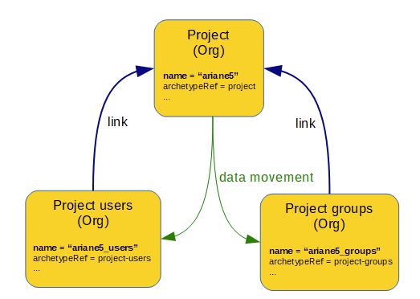

= Linked Objects Scenario 3: Projects
:page-nav-title: Scenario 3: Projects
:page-wiki-name: Linked objects scenario 3: Projects
:page-wiki-id: 52002935
:page-wiki-metadata-create-user: mederly
:page-wiki-metadata-create-date: 2020-06-02T01:10:26.344+02:00
:page-wiki-metadata-modify-user: mederly
:page-wiki-metadata-modify-date: 2020-06-02T11:25:15.965+02:00
:page-toc: top

[WARNING]
====
This scenario uses unfinished/experimental xref:/midpoint/reference/synchronization/linked-objects/named-object-links/[named object links] feature.
It is very powerful but even more experimental than linked objects feature as a whole!
So beware, everything described here can change any time.
====

== Overview

Let us work with projects modeled as `OrgType` objects of archetype `project`. Each project named `P` has two child orgs.
The first (named `
_users`, having archetype of `project-users`) contains users working on that particular project.
The second (named `
_groups`, having archetype of `project-groups`) contains groups that are related to that project.

. When a project is created, those children have to be created automatically.

. When a project is renamed, those two children should be renamed automatically.

. When a project is deleted, those children have to be deleted automatically.

== An implementation overview

As usual, the implementation has two parts:

. Implementing the data transfers as such.
There are two simple mappings (that set sub-orgs `name` attribute) that ensure this.

. Triggering the recomputation of linked objects.
There are three policy rules doing that.

== Data transfer implementation using mappings

This is how `project-users` archetype looks like:

.Archetype of project-users
[source,xml]
----
<archetype xmlns="http://midpoint.evolveum.com/xml/ns/public/common/common-3"
           oid="3af67ba4-183f-45e7-887e-4ae5ddff4cdf">
    <name>project-users</name>
    <documentation>
        "Users" sub-org for project org.
    </documentation>

    <archetypePolicy>
        <links>
            <targetLink>
                <name>parent</name>
                <selector>
                    <type>OrgType</type>
                    <archetypeRef oid="4d3280a1-6514-4984-ac2c-7e56c05af258" /> <!-- project -->
                </selector>
            </targetLink>
        </links>
    </archetypePolicy>

    <inducement>
        <focusMappings>
            <mapping>
                <strength>strong</strength>
                <expression>
                    
                </expression>
                <target>
                    <path>name</path>
                </target>
            </mapping>
        </focusMappings>
    </inducement>

</archetype>

----

First of all, a link type of `parent` is defined.
It denotes the parent org of any "users" sub-org.

The mapping that follows derives sub-org name from the name of the parent by suffixing it by "_users" text.
Nothing special here.

The archetype of `project-groups` looks exactly the same.

inked user (if any).
And the mapping returns the value for the `description` property accordingly.

== Change propagation

All what is needed to propagate changes (creation/modification/deletion of parent org) is present in `project` archetype.
It starts like this:

.The first part of "project" archetype
[source,xml]
----
<archetype xmlns="http://midpoint.evolveum.com/xml/ns/public/common/common-3"
           xmlns:s="http://midpoint.evolveum.com/xml/ns/public/model/scripting-3"
           oid="4d3280a1-6514-4984-ac2c-7e56c05af258">
    <name>project</name>
    <documentation>
        A project has two child objects: users and groups.
        1. These are to be created when project is created.
        2. They need to be deleted when project is deleted.
        3. They need to be renamed when project is renamed.
    </documentation>

    <archetypePolicy>
        <links>
            <sourceLink>
                <name>usersOrg</name>
                <selector>
                    <type>OrgType</type>
                    <archetypeRef oid="3af67ba4-183f-45e7-887e-4ae5ddff4cdf" /> <!-- project-users -->
                </selector>
            </sourceLink>
            <sourceLink>
                <name>groupsOrg</name>
                <selector>
                    <type>OrgType</type>
                    <archetypeRef oid="a85bddc9-4ff0-475f-8ccc-17f9038d4ce1"/> <!-- project-groups -->
                </selector>
            </sourceLink>
        </links>
    </archetypePolicy>
    ...
</archetype>

----

We see a definition of two link types here.
One is called `usersOrg` and points to the `OrgType` of  `project-users` archetype that has the `project` as its parent (assignment target).
The other one is called `groupsOrg` and points to the `OrgType` of  `project-groups` archetype that - again - has the `project` as its parent.

=== Project creation

Further there is a policy rule that creates children when `project` org is created:

.Policy rule for children creation
[source,xml]
----
<archetype xmlns="http://midpoint.evolveum.com/xml/ns/public/common/common-3"
           xmlns:s="http://midpoint.evolveum.com/xml/ns/public/model/scripting-3"
           oid="4d3280a1-6514-4984-ac2c-7e56c05af258">
    ...
    <inducement>
        <policyRule>
            <name>create-children-on-new-project-creation</name>
            <documentation>
                Creates children when new project is created.
            </documentation>
            <policyConstraints>
                <modification>
                    <operation>add</operation>
                </modification>
            </policyConstraints>
            <policyActions>
                <scriptExecution>
                    <!-- no object spec, so executed on the object itself -->
                    <executeScript>
                        <s:pipeline>
                            <s:execute>
                                <s:script>
                                    <code>
                                        // Returning two objects - they will be created in the second action
                                        [midpoint.createLinkedSource('usersOrg'),
                                         midpoint.createLinkedSource('groupsOrg')]
                                    </code>
                                </s:script>
                                <s:outputTypeName>OrgType</s:outputTypeName>
                            </s:execute>
                            <s:add/> <!-- creates objects prepared above -->
                        </s:pipeline>
                    </executeScript>
                </scriptExecution>
            </policyActions>
        </policyRule>
    </inducement>
    ...
</archetype>

----

It is executed against the `project` org itself - no linkSource/linkTarget specification is there.
And it is a two-step pipeline:

. The first step uses `midpoint.createLinkedSource` method (of PoC quality only, rather unfinished) to create objects from the respective link type specifications.
Those objects are very simple, each one contains only a reference to its parent (the project) and its archetype (derived from the link type).
Everything else is computed from the archetype itself in the second step.

. And the second step i.e. `s:add` action creates the objects.

=== Project deletion

What about deletion?

.Policy rule for children deletion
[source,xml]
----
<archetype xmlns="http://midpoint.evolveum.com/xml/ns/public/common/common-3"
           xmlns:s="http://midpoint.evolveum.com/xml/ns/public/model/scripting-3"
           oid="4d3280a1-6514-4984-ac2c-7e56c05af258">
    ...
    <!--
     Actually, this one is fake: assignments/inducements are NOT evaluated on object deletion (yet).
     So the same rule is included as a global policy rule in system configuration.
     -->
    <inducement>
        <policyRule>
            <name>delete-children-on-project-deletion</name>
            <documentation>
                Deletes children when project is deleted.
            </documentation>
            <policyConstraints>
                <modification>
                    <operation>delete</operation>
                </modification>
            </policyConstraints>
            <policyActions>
                <scriptExecution>
                    <object>
                        <namedLinkSource>usersOrg</namedLinkSource>
                        <namedLinkSource>groupsOrg</namedLinkSource>
                    </object>
                    <executeScript>
                        <s:delete/>
                    </executeScript>
                </scriptExecution>
            </policyActions>
        </policyRule>
    </inducement>
    ...
</archetype>

----

The policy rule should look like the above.
Unfortunately, those assigned rules are ignored on object deletion, so we must place this rule into system configuration as a global policy rule instead:

.Global policy rule for children deletion
[source,xml]
----
<!-- This role is here because of assignments not being applied on object deletion. -->
<globalPolicyRule>
    <focusSelector>
        <type>OrgType</type>
        <archetypeRef oid="4d3280a1-6514-4984-ac2c-7e56c05af258" /> <!-- project -->
    </focusSelector>
    <name>delete-children-on-project-deletion</name>
    <documentation>
        Deletes children when project is deleted.
    </documentation>
    <policyConstraints>
        <modification>
            <operation>delete</operation>
        </modification>
    </policyConstraints>
    <policyActions>
        <scriptExecution>
            <object>
                <namedLinkSource>usersOrg</namedLinkSource>
                <namedLinkSource>groupsOrg</namedLinkSource>
            </object>
            <executeScript>
                <s:delete/>
            </executeScript>
        </scriptExecution>
    </policyActions>
</globalPolicyRule>

----

=== Project modification (renaming)

And, finally this is the policy rule dealing with project renaming:

[source,xml]
----
<archetype xmlns="http://midpoint.evolveum.com/xml/ns/public/common/common-3"
           xmlns:s="http://midpoint.evolveum.com/xml/ns/public/model/scripting-3"
           oid="4d3280a1-6514-4984-ac2c-7e56c05af258">
    ...
    <inducement>
        <policyRule>
            <name>recompute-children-on-project-rename</name>
            <documentation>
                Recomputes children when the project is renamed.
            </documentation>
            <policyConstraints>
                <modification>
                    <operation>modify</operation>
                    <item>name</item>
                </modification>
            </policyConstraints>
            <policyActions>
                <scriptExecution>
                    <object>
                        <namedLinkSource>usersOrg</namedLinkSource>
                        <namedLinkSource>groupsOrg</namedLinkSource>
                    </object>
                    <executeScript>
                        <s:recompute/>
                    </executeScript>
                </scriptExecution>
            </policyActions>
        </policyRule>
    </inducement>
</archetype>
----

It is quite self-describing.

Only a small note here: `<namedLinkSource>X</namedLinkSource>` element is, in fact, a shortcut for `<linkSource><linkType>X</linkType></linkSource>`. We'll see if it should be preserved in the future or if it will be discontinued because of redundancy.

Complete configuration for this scenario is in link:https://github.com/Evolveum/midpoint/tree/master/model/model-intest/src/test/resources/linked/projects[https://github.com/Evolveum/midpoint/tree/master/model/model-intest/src/test/resources/linked/projects] directory (and system configuration in the parent one).
