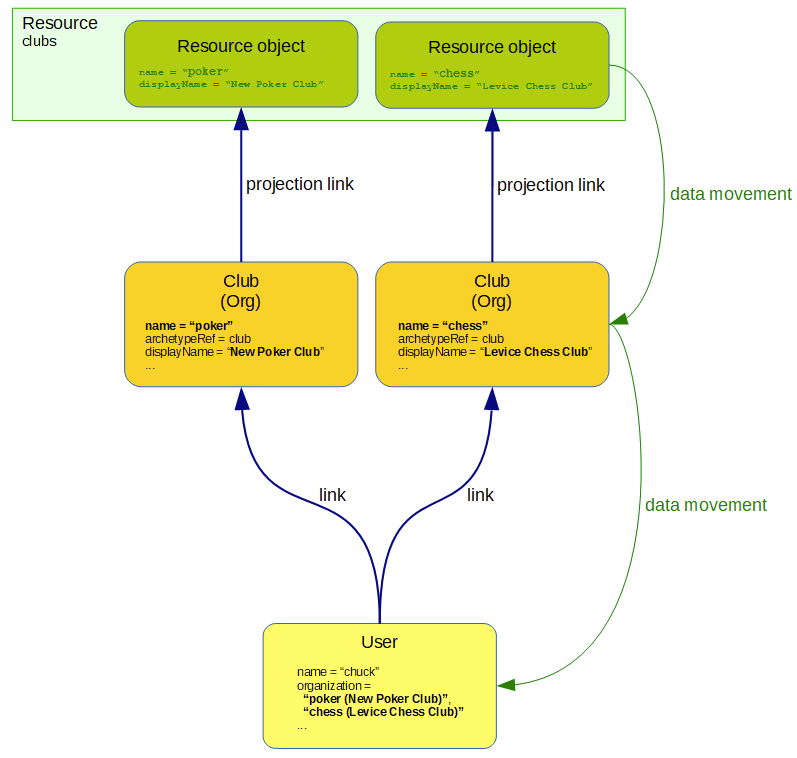

= Linked Objects Scenario 4: Clubs
:page-nav-title: Scenario 4: Clubs
:page-wiki-name: Linked objects scenario 4: Clubs
:page-wiki-id: 52002959
:page-wiki-metadata-create-user: mederly
:page-wiki-metadata-create-date: 2020-06-02T11:28:14.487+02:00
:page-wiki-metadata-modify-user: mederly
:page-wiki-metadata-modify-date: 2020-06-02T12:09:26.542+02:00
:page-since: "4.2"
:page-toc: top

== Overview

Let's have _clubs_ that are synchronized from the `clubs` resource.
Each club provides some data to its _members_: `organization` property gets a value of "club name (club display name)" for each club the user is a member of.

When synchronizing clubs from the resource we want to automatically propagate changes in club name or display name to their members.

== An implementation overview

As usual, the implementation has two parts:

. Implementing the data transfers.
This is done via inbound mappings in `clubs` resource and in object template for users.

. Triggering the recomputation of linked objects.
There is a policy rule doing that.

== Data transfer implementation using mappings

Schema handling on the resource:

.Schema handling for clubs resource
[source,xml]
----
<schemaHandling>
    <objectType>
        <kind>entitlement</kind>
        <intent>default</intent>
        <default>true</default>
        <objectClass>ri:GroupObjectClass</objectClass>
        <attribute>
            <ref>icfs:name</ref>
            <inbound>
                <strength>strong</strength>
                <target>
                    <path>name</path>
                </target>
            </inbound>
            <inbound>
                <expression>
                    <assignmentTargetSearch>
                        <targetType>ArchetypeType</targetType>
                        <oid>fefa9261-b897-439c-ad79-15f10d547bba</oid> <!-- club -->
                    </assignmentTargetSearch>
                </expression>
                <target>
                    <path>assignment</path>
                </target>
            </inbound>
        </attribute>
        <attribute>
            <ref>ri:displayName</ref>
            <inbound>
                <strength>strong</strength>
                <target>
                    <path>displayName</path>
                </target>
            </inbound>
        </attribute>
        <!-- No members on this resource. They are assigned explicitly in midPoint. -->
    </objectType>
</schemaHandling>

----

There is nothing special here.
Name and display name is propagated from resource to objects and the archetype of `club` is set.

The second part of data transfer is in user template:

.User template setting organization property values
[source,xml]
----
<objectTemplate xmlns="http://midpoint.evolveum.com/xml/ns/public/common/common-3"
                oid="7d6bf307-58c2-4ea9-8599-19586623b41a">
    <name>template-user</name>
    ...
    <item>
        <ref>organization</ref>
        <mapping>
            <evaluationPhase>afterAssignments</evaluationPhase>
            <strength>strong</strength>
            <expression>
                
            </expression>
            <target>
                <set>
                    <predefined>all</predefined>
                </set>
            </target>
        </mapping>
    </item>
</objectTemplate>
----

(The code could be made a bit more concise if xref:/midpoint/reference/synchronization/linked-objects/named-object-links/[named object links] are used.)

== Change propagation

Propagation of name and display name changes is ensured using the following policy rule (present in archetype `club`):

.The "club" archetype
[source,xml]
----
<archetype xmlns="http://midpoint.evolveum.com/xml/ns/public/common/common-3"
           xmlns:s="http://midpoint.evolveum.com/xml/ns/public/model/scripting-3"
           oid="fefa9261-b897-439c-ad79-15f10d547bba">
    <name>club</name>

    <inducement>
        <policyRule>
            <documentation>
                When club name or displayName changes, members must be recomputed
                (but only if requested by an execution option).
            </documentation>
            <policyConstraints>
                <or>
                    <modification>
                        <item>name</item>
                    </modification>
                    <modification>
                        <item>displayName</item>
                    </modification>
                </or>
            </policyConstraints>
            <policyActions>
                <scriptExecution>
                    <object>
                        <linkSource/>
                    </object>
                    <executeScript>
                        <s:recompute>
                            <!--
                                We use optimized triggers because we expect that members will be recomputed during
                                reconciliation of 'clubs' resource. Reconciliation can result in modification of
                                a number of clubs at approximately the same time. So it's better to avoid repeated
                                recomputation of individual members by using triggers - or even better, optimizing
                                delayed triggers.
                            -->
                            <s:triggered>
                                <fireAfter>PT1M</fireAfter>
                            </s:triggered>
                        </s:recompute>
                    </executeScript>
                    <asynchronousExecution>
                        <taskCustomizer>
                            
                        </taskCustomizer>
                    </asynchronousExecution>
                </scriptExecution>
            </policyActions>
        </policyRule>
        <condition>
            <expression>
                
            </expression>
        </condition>
    </inducement>
</archetype>

----

We demonstrate turning on and off of the recomputation by including a condition looking for `recomputeMembers` value.
The default is (in this case) not doing the recomputation if option is not present.

We also show how worker threads are set.
They are derived from `memberRecomputationWorkerThreads` extension option.

The options are defined like this (copied from the midPoint integration test suite link:https://github.com/Evolveum/midpoint/blob/2918d740226dedf7108a2f84accd452e273c8f52/model/model-intest/src/test/resources/schema/linked.xsd[file]):

.Schema for model execution options extension
[source,xml]
----
<xsd:schema elementFormDefault="qualified"
            targetNamespace="http://midpoint.evolveum.com/xml/ns/samples/linked"
            xmlns:tns="http://midpoint.evolveum.com/xml/ns/samples/linked"
            xmlns:c="http://midpoint.evolveum.com/xml/ns/public/common/common-3"
            xmlns:a="http://prism.evolveum.com/xml/ns/public/annotation-3"
            xmlns:t="http://prism.evolveum.com/xml/ns/public/types-3"
            xmlns:xsd="http://www.w3.org/2001/XMLSchema">

    <xsd:import namespace="http://prism.evolveum.com/xml/ns/public/types-3"/>
    <xsd:import namespace="http://midpoint.evolveum.com/xml/ns/public/common/common-3"/>

    <xsd:complexType name="ModelExecutionOptionsTypeExtensionType">
        <xsd:annotation>
            <xsd:appinfo>
                <a:extension ref="c:ModelExecuteOptionsType"/>
            </xsd:appinfo>
        </xsd:annotation>
        <xsd:sequence>
            <xsd:element ref="tns:recomputeMembers" minOccurs="0"/>
            <xsd:element ref="tns:memberRecomputationWorkerThreads" minOccurs="0"/>
        </xsd:sequence>
    </xsd:complexType>

    <xsd:element name="recomputeMembers" type="xsd:boolean">
        <xsd:annotation>
            <xsd:documentation>
                Enables or disables recomputation of members - for abstract roles or their archetypes
                that look at this extension property. See e.g. archetype-department and its condition
                "midpoint.extensionOptionIsNotFalse('recomputeMembers')".
            </xsd:documentation>
        </xsd:annotation>
    </xsd:element>

    <xsd:element name="memberRecomputationWorkerThreads" type="xsd:int">
        <xsd:annotation>
            <xsd:documentation>
                Specifies the number of worker threads for "member recompute" tasks. Used by abstract
                roles or their archetypes that look at this extension property.
                See e.g. archetype-department and its task customizer.
            </xsd:documentation>
        </xsd:annotation>
    </xsd:element>
</xsd:schema>

----

=== Setting up recomputation when synchronizing

Imagine we want to invoke automatic member recomputation during synchronization of clubs resource.
The synchronization reaction would look like this:

.Sample synchronization reaction that includes member recomputation
[source,xml]
----
<reaction>
    <situation>linked</situation>
    <synchronize>true</synchronize>
    <executeOptions>
        <extension>
            <linked:recomputeMembers>true</linked:recomputeMembers>
            <linked:memberRecomputationWorkerThreads>4</linked:memberRecomputationWorkerThreads>
        </extension>
    </executeOptions>
</reaction>

----

(Although it should be perhaps more logical to make member recomputation enabled by default, so it would be applied even when changes come e.g. from GUI or REST or other sources.

Complete configuration for this scenario is in link:https://github.com/Evolveum/midpoint/tree/master/model/model-intest/src/test/resources/member-recompute[https://github.com/Evolveum/midpoint/tree/master/model/model-intest/src/test/resources/member-recompute] directory.