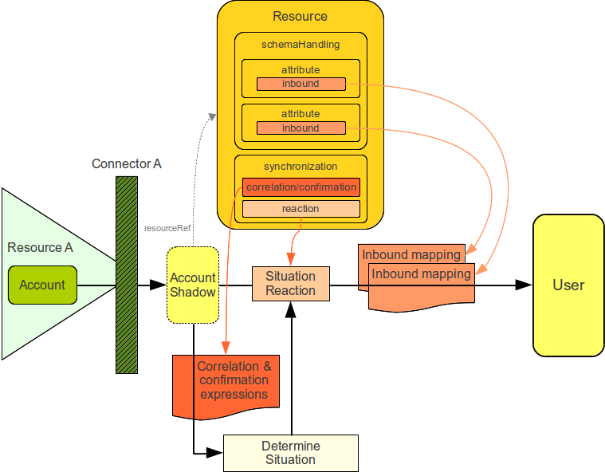

= Synchronization Policies
:page-wiki-name: Synchronization Policies
:page-wiki-id: 6881505
:page-wiki-metadata-create-user: semancik
:page-wiki-metadata-create-date: 2012-12-11T17:04:44.158+01:00
:page-wiki-metadata-modify-user: semancik
:page-wiki-metadata-modify-date: 2012-12-11T19:22:04.076+01:00
:page-upkeep-status: red
:page-nav-title: Policies

Complex synchronization policy is composed from three somehow distinct parts:

* *Inbound phase* of synchronization policy processing controls how information gets *into midPoint*. I.e. it controls the flow from accounts to user.

* *User policy phase* of synchronization policy processing controls the content of user objects.
It can be used to fill out missing user properties, enforce specific values, react to property change e.g. by automatically assigning roles, etc.

* *Outbound phase* of synchronization policy processing controls how information gets *out of midPoint*. I.e. it controls the flow from user to accounts.

The composition of the three parts is illustrated in the following diagram.

The most significant part of each phase is application of xref:/midpoint/reference/expressions/mappings/[mappings]. The input and output of applied mappings is different for each phase.
Following table provides the summary.

[%autowidth,cols="h,1,1"]
|===
|  Phase  |  Mapping source  |  Mapping target

|  Inbound
|  Account (shadow)
|  User

|  User Policy
|  User
|  User

|  Outbound
|  User
|  Account (shadow)

|===

The application of mappings and also other activities taken during the phases are illustrated in a simplified form in the following diagram.

Following sections contain detailed description of each individual phase.

== Inbound Phase

== User Policy Phase

== Outbound Phase

