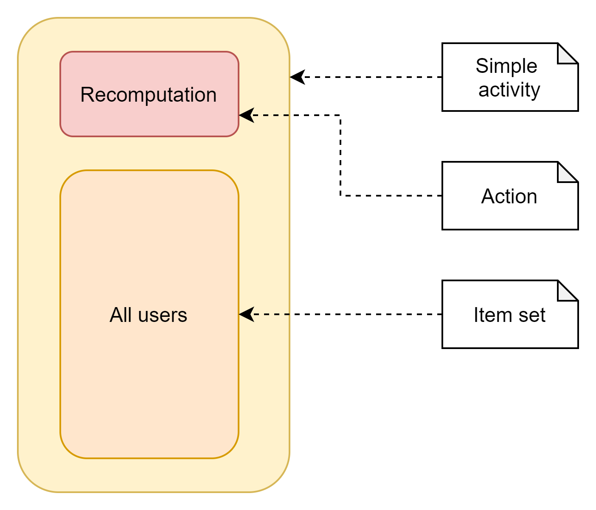
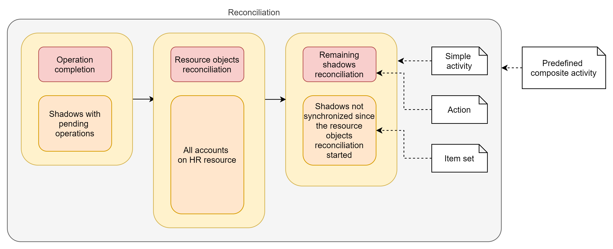

= Activities
:toc:
:page-since: "4.4"
:page-upkeep-status: green

== Introduction

Since the beginning of midPoint, a _task_ represented something that should be done, like importing
all accounts from a given resource. Such tasks could be created, executed, checked for the current
status and progress, and so on. Gradually, tasks grew rich in features: multi-thread and multi-node
processing, ability to suspend and resume (continuing where the work has stopped), various kinds
of statistics, and error-reporting and handling options.

Somewhere around midPoint 4.2, we have realized that a task is something that can have
a rich internal structure: it can consist of distinct "parts". An example is the reconciliation
task that typically consists of operation completion, resource objects reconciliation, and remaining
shadows reconciliation.

In midPoint 4.4 we finally have found a suitable conceptual model for the tasks and their work:
the activities.

== Activities

An _activity_ describes the real work that should be carried out. It can be either simple or composite.

_Simple activities_ consist of a single _action_, carried out on a set of input _items_ (zero, one,
or more ones). Typical examples are recomputation, import from resource, or iterative bulk action.

On the other hand, _composite activities_ consist of a set of other activities - again, either simple
or composite. Composite activities can be _predefined_ (like reconciliation or cleanup) or
_custom_. Note that composite activities do not have their own actions nor item sets. They are defined
solely by their constituent sub-activities.footnote:[This is not 100% true, as there may be
some auxiliary actions, like recording a starting timestamp for reconciliation, that are built into
the predefined composition logic. But those are really minor actions, not visible from the outside.
However, in the future we may be able to define custom composition logic for predefined or even for
custom composite activities.]

=== A Few Examples

==== Example 1: User recomputation - a simple activity with a set of input items

This activity runs a `recomputation` action over a set of all users.

==== Example 2: Non-iterative bulk action - a simple activity with no input items

image::activity-non-iterative-bulk-action.png[width=400,alt="Non-iterative bulk action"]

This activity runs a `nonIterativeScripting` action (i.e. non-iterative bulk action).
The bulk action does not expect any input items. It simply runs a provided Groovy script (in this case).

==== Example 3: Reconciliation - a (predefined) composite activity

The reconciliation activity consists of a three sub-activities. They are partially dependent:
the third one (remaining shadows reconciliation) depends on the second one (resource objects reconciliation).

Each of the sub-activities has a different action, and a different item set.

==== Example 4: User recomputation + custom bulk action - a (custom) composite activity

image::activity-user-recomputation-with-custom-bulk-action.png[width=700,alt="User recomputation with bulk action"]

== Configuring the Activities

=== Configuring Simple and Predefined Composite Activities

A definition of a simple (or predefined composite) activity contains the following sections:

[%header]
[%autowidth]
|===
| Section | Meaning
| link:work[`work`] | The work that is to be done. Contains the definition of the activity and the item set.
| link:execution-mode[`executionMode`] | Defines the overall mode of execution: `full`, `preview`, `dryRun`, `none`,
`bucketAnalysis`.
| link:control-flow[`controlFlow`] | Items like prerequisites, preconditions, error handling strategy, and so on.
| link:distribution[`distribution`] | Distribution of the work executed as part of this activity into threads, buckets, and worker tasks.
| link:reporting[`reporting`] | How various aspects of activity execution are reported, using logging, tracing,
profiling, reporting, and so on.
| link:tailoring[`tailoring`] | Tailors the definition of individual sub-activities in a predefined composite activity.
|===

(More details are provided in the linked documents.)

=== Configuring Custom Composite Activities

In a current implementation, the custom composite activity definition contains just a single section:

[%header]
[%autowidth]
|===
| Section | Meaning
| `composition` | Defines the composite activity as a set of its constituent sub-activities.
|===

NOTE: There is a `defaultWorkDefinition` item in the `composition` section, but it is not supported yet.
It will be used to define a default work definition for the sub-activities. Neither we do not yet support
inheriting the non-functional aspects (`executionMode`, `controlFlow`, `distribution`, `reporting`) from
the composite to the sub-activities. Therefore, the sub-activities have to be fully defined, independently
of each other.

== Activities and Tasks

#TODO#

== Migration from 4.3 and before

#TODO#

== GUI support

#TODO#
