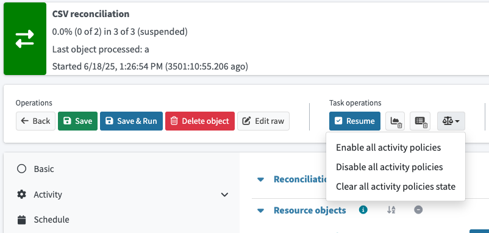

= Activity policies
:page-since: "4.10"
:page-toc: top
:page-upkeep-status: green
:page-summary: This page describes activity policies that define when a task activity should react to specific conditions and how it should respond through actions that improve reliability and resilience.
:page-keywords: activity policies, task activities, task reliability, task resilience, task error handling

This page describes activity policies that define when a task activity should react to specific conditions and how it should respond through actions that improve reliability and resilience.

== Introduction

Activity policy rules provide a way to define actions to certain situations happening during activity execution.
These situations are defined by policy constraints, while reactions are defined by policy actions.
Each policy can have one or more constraints and one or more actions.

Activity policies are primarily intended to be used to improve task reliability and resilience.
They are defined per activity, so different activities in the same task may have different policies.

If a policy has to evaluate an object that is being processed by clockwork (like provisioning, reconciliation, etc.), then
xref:./thresholds[thresholds] or xref:/midpoint/reference/roles-policies/policies/policy-rules/[global policy rules] with proper constraints should be used instead.

Currently, focus policy rule constraints cannot be used in activity policies.

Policies are collected during activity initialization from the activity definition and its parent activity definitions (in case of composite activities).
Policies are evaluated after each item in an iterative activity is processed.

See a high level overview of activity policy processing:

* If a constraint is _not_ triggered, nothing happens.
* If a constraint is triggered:
    ** If the policy has a threshold defined:
        *** The counter for the policy is incremented.
        *** If a threshold is reached, policy actions are executed.
    ** If the policy does not have a threshold defined:
        *** Policy actions are executed.
    ** Policy trigger and message are stored in the activity state, along with a reference to a specific policy.

== Policy constraints

Policy constraints define conditions under which a policy should be triggered.

=== Execution time

The _execution time_ constraint checks the activity execution time.
If the activity is distributed to multiple worker tasks, midPoint measures the time when at least one worker task is executing.
The time measurement is not restarted when related tasks are suspended and resumed.
Only when the activity is <<restartactivity,restarted>> via the `restartActivity` policy action, the time measurement starts from zero.

When the `exceeds` element is specified, the constraint will trigger if the task execution time exceeds the specified value.
When the `below` element is specified, the constraint will trigger if the task execution time is below the specified value.
Both elements can be specified together to define a time range when the constraint should be triggered.

The execution time for composite activities (like reconciliation) is computed as a sum of the execution times of child activities.

.Example of an execution time constraint using `exceeds`
[source,xml]
----
<policyConstraints>
    <executionTime>
        <!-- <below>PT15M</exceeds> -->
        <exceeds>PT1H</exceeds>
    </executionTime>
</policyConstraints>
----

=== Execution attempts

The _execution attempts_ constraint checks the number of execution attempts for an activity.
The execution attempts counter is increased by the `<<restartactivity,restartActivity>>` policy action.
Suspending and resuming the activity (more precisely, its task) does not increase the number of execution attempts.

When the `exceeds` element is specified, the constraint will trigger if the number of attempts exceeds the specified value.
When the `below` element is specified, the constraint will trigger if the number of attempts is below the specified value.
Both elements can be specified together to define a range when the constraint should be triggered.

.Example of a policy constraint that is triggered after 3 execution attempts
[source,xml]
----
<policyConstraints>
    <executionAttempts>
        <exceeds>3</exceeds>
    </executionTime>
</policyConstraints>
----

=== Item processing result

The _item processing result_ constraint evaluates the result of a processing of an item (object) by an activity.
The constraint contains two parameters:

* `status` - An operation result status to match.
It can be either `PARTIAL_ERROR` or `FATAL_ERROR`.
If not present, we rely solely on the error category.
If error categories are not specified, any error matches.

* `errorCategory` - An error category (network, security, policy, ...) to match.
If not present, we rely solely on the status.
+
NOTE: Some errors are not propagated to the level where they can be recognized by this selector.

.Example of an item processing result constraint
[source,xml]
----
<policyConstraints>
    <itemProcessingResult>
        <status>partial_error</status>
        <errorCategory>network</errorCategory>
    </itemProcessingResult>
</policyConstraints>
----

=== And/or/not

Logical constraints are implemented to help you combine multiple constraints into one.
By default, `and` is used to combine constraints defined directly under the `policyConstraints` element.

== Policy actions

Policy actions are the configured reactions that the system executes when a policy constraint is triggered.
They define what should happen (immediately or after a threshold is reached) to an activity or task.
The typical actions include sending a notification or suspending tasks.

=== Notification

The _notification_ policy action uses the standard notification mechanism, so it can be configured in the system configuration.

.Part of a system configuration object with the default activity policy notifier
[source,xml]
----
<systemConfiguration xmlns="http://midpoint.evolveum.com/xml/ns/public/common/common-3">

    <!-- Other system configuration elements -->

    <notificationConfiguration>
        <handler>
            <simpleActivityPolicyRuleNotifier><!--1-->
                <transport>mail</transport>
            </simpleActivityPolicyRuleNotifier>
        </handler>
    </notificationConfiguration>

    <!-- Example to redirect email notification to file -->
    <messageTransportConfiguration>
        <mail>
            <name>mail</name>
            <redirectToFile>~/mail.txt</redirectToFile>
            <defaultFrom>idm@example.com</defaultFrom>
        </mail>
    </messageTransportConfiguration>
</systemConfiguration>
----

<1> An activity policy notifier using the default configuration for to, cc, bcc, body, etc.

.Notification action configuration in activity policy
[source,xml]
----
<policyActions>
    <notification/>
</policyActions>
----

=== Suspend task

The _suspend task_ policy action will immediately suspend the whole task or task tree that executes the activity.
Task will be suspended with `FATAL_ERROR` result.

[[restartactivity]]
=== Restart activity

The _restart activity_ action restarts the current activity execution.
As a result, the activity starts processing from the beginning.
This action is useful when activity processing fails due to temporary problems (like network issues).

Restarting of the activity happens in two steps:

. The current activity execution is stopped by suspending the task.
. The task is resumed, which causes the activity to start from the beginning.

Restarting of the task may be delayed by using the `delay` parameter, which is specified as an XML duration.
The default delay parameter value is 5 seconds.
The actual delay is taken as a random number between `0` and `delay * (2 ^ (n - 1))`, where `n` is the number of execution attempts of the activity (with the maximum of `11`).
If the delay is set to `0`, the task will be resumed immediately.

//Second optional parameter for this parameter is called `restartCounters`.
//It can be used to preserve activity policy counters during restarts.

.Example of a restart activity action with a delay
[source,xml]
----
<policyActions>
    <restartActivity>
        <!-- 10 minutes delay -->
        <delay>PT10M</delay>
    </restartActivity>
</policyActions>
----

=== Skip activity

The _skip activity_ policy action stops the current activity execution immediately.
No further items of that activity should be processed.
(There are some limitations regarding multi-node activities.
Not all workers may react immediately.)

The execution continues with the next activity (if any) in the activity tree.
If the skipped activity was the last one, the task completes normally, but with a fatal error in the operation result as the policy was triggered.

If a task is suspended and resumed later, the skipped activity is not executed again.

.Example of a skip activity action
[source,xml]
----
<policyActions>
    <skipActivity/>
</policyActions>
----

== User interface

Activity policies are configured in the activity definition XML only.

All activity policies may be enabled or disabled via the user interface in task details.
This is useful when you want to force a task to finish even when some policies prevent it from happening (e.g., there is a triggered policy that suspends the task).

The task details UI also allows users to clear all activity policy triggers and counters, while keeping the policies and activity state untouched.

.Activity policies options in task details

== Limitations

* Activity policies are evaluated only for iterative (plain iterative or search based) activities.
Activity policies are not supported in:
    ** Non-iterative scripting
    ** Role analysis clustering
    ** Role analysis pattern detection
    ** Repartition
    ** Cleanup
    ** Custom composite activities
* Focus policy constraints currently cannot be used in activity policies.
* User interface support is limited to XML configuration only.

== Examples

.Simple policy that will suspend the task if an activity runs for more than 30 minutes and sends a notification
[source,xml]
----
include::activity-policies/00-policy-simple.xml[]
----

.Restart activity if it runs more than 30 minutes, after 3 restarts suspend the task
[source,xml]
----
include::activity-policies/01-policy-simple-restart-suspend.xml[]
----

.Policy rule that restarts an activity with a delay if there was a network error and skips activity after three restarts attempts
[source,xml]
----
include::activity-policies/02-policy-network-error-restart.xml[]
----

== See also

* xref:/midpoint/reference/tasks/thresholds[]
* xref:/midpoint/reference/roles-policies/policies/policy-rules/[Policy Rules]
* xref:/midpoint/architecture/concepts/task/[Task]
* xref:/midpoint/devel/design/multi-node-partitioned-and-stateful-tasks/task-partitioning/[Task partitioning]
* Related issue bug:MID-10411[]
