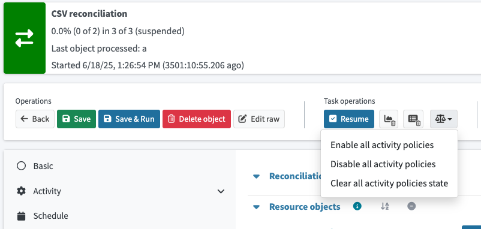

= Activity policies
:page-since: "4.10"
:page-toc: top
:page-upkeep-status: green
:page-description: This page describes activity policies that define when a task activity should react to specific conditions and how it should respond through actions that improve reliability and resilience.
:page-keywords: activity policies, task activities, task reliability, task resilience, task error handling

This page describes activity policies that define when a task activity should react to specific conditions and how it should respond through actions that improve reliability and resilience.

== Introduction

Activity policy rules provide a way to define actions to certain situations happening during activity execution.
These situations are defined by policy constraints, while reactions are defined by policy actions.
Each policy can have one or more constraints and one or more actions.

Activity policies are primarily intended to be used to improve task reliability and resilience.
They are defined per activity, so different activities in the same task may have different policies.

If a policy has to evaluate an object that is being processed by clockwork (like provisioning, reconciliation, etc.), then
xref:./thresholds[thresholds] or xref:/midpoint/reference/roles-policies/policies/policy-rules/[global policy rules] with proper constraints should be used instead.

Since midPoint 4.11, focus policy rule constraints can also be applied to objects processed by an activity.
See xref:./focus-policies-in-activities[Focus policies in activities] for details.

Policies are collected during activity initialization from the activity definition and its parent activity definitions (in case of composite activities).
Policies are evaluated after each item in an iterative activity is processed.
Rules declared on parent activities are evaluated before the rules of the activity itself.
Within a single activity, rules are evaluated in the order given by their optional `order` property; rules without `order` come last.

See a high level overview of activity policy processing:

* If a constraint is _not_ triggered, nothing happens.
* If a constraint is triggered:
    ** If the policy has a threshold defined:
        *** The counter for the policy is incremented.
        *** If a threshold is reached, policy actions are executed.
    ** If the policy does not have a threshold defined:
        *** Policy actions are executed.
    ** Policy trigger and message are stored in the activity state, along with a reference to a specific policy.

== Policy constraints

Policy constraints define conditions under which a policy should be triggered.

=== Execution time

The _execution time_ constraint checks the activity execution time.
If the activity is distributed to multiple worker tasks, midPoint measures the time when at least one worker task is executing.
The time measurement is not restarted when related tasks are suspended and resumed.
Only when the activity is <<restartactivity,restarted>> via the `restartActivity` policy action, the time measurement starts from zero.

When the `exceeds` element is specified, the constraint will trigger if the task execution time exceeds the specified value.
When the `below` element is specified, the constraint will trigger if the task execution time is below the specified value.
Both elements can be specified together to define a time range when the constraint should be triggered.
Both bounds are exclusive: the constraint triggers only when the execution time is strictly greater than `exceeds`, or strictly less than `below`.
When neither element is specified, the constraint triggers on every evaluation.

The execution time for composite activities (like reconciliation) is computed as a sum of the execution times of child activities.

.Example of an execution time constraint using `exceeds`
[source,xml]
----
<policyConstraints>
    <executionTime>
        <!-- <below>PT15M</exceeds> -->
        <exceeds>PT1H</exceeds>
    </executionTime>
</policyConstraints>
----

=== Execution attempts

The _execution attempts_ constraint checks the number of execution attempts for an activity.
The execution attempts counter is increased by the `<<restartactivity,restartActivity>>` policy action.
Suspending and resuming the activity (more precisely, its task) does not increase the number of execution attempts.

When the `exceeds` element is specified, the constraint will trigger if the number of attempts exceeds the specified value.
When the `below` element is specified, the constraint will trigger if the number of attempts is below the specified value.
Both elements can be specified together to define a range when the constraint should be triggered.
Both bounds are exclusive: the constraint triggers only when the number of attempts is strictly greater than `exceeds`, or strictly less than `below`.
When neither element is specified, the constraint triggers from the second execution attempt on.

.Example of a policy constraint that is triggered after 3 execution attempts
[source,xml]
----
<policyConstraints>
    <executionAttempts>
        <exceeds>3</exceeds>
    </executionTime>
</policyConstraints>
----

=== Item processing result

The _item processing result_ constraint evaluates the result of a processing of an item (object) by an activity.
The constraint contains two parameters:

* `status` - An operation result status to match.
It is usually `PARTIAL_ERROR` or `FATAL_ERROR`.
If not present, the decision is based solely on the error category.

* `errorCategory` - An error category (network, security, policy, ...) to match.
The category is determined from the exception recorded for the item, so it can match only when the item processing ended with an exception.
If not present, the decision is based solely on the status.
+
NOTE: Some errors are not propagated to the level where they can be recognized by this selector.
See xref:#_limitations[Limitations] for more details.

At least one status or error category must be specified.
A constraint with neither of them never triggers.

.Example of an item processing result constraint
[source,xml]
----
<policyConstraints>
    <itemProcessingResult>
        <status>partial_error</status>
        <errorCategory>network</errorCategory>
    </itemProcessingResult>
</policyConstraints>
----

=== And/or/not

Logical constraints are implemented to help you combine multiple constraints into one.
By default, `and` is used to combine constraints defined directly under the `policyConstraints` element.

Activity-based constraints (such as `executionTime`) and focus-based constraints (see xref:./focus-policies-in-activities[Focus policies in activities]) cannot be combined within a single policy rule.
Each rule must use only one of the two kinds.
Note that mixing them is not reported as a configuration error: such a rule is evaluated as an activity policy and its focus-based constraints are silently ignored.

== Policy thresholds

A policy without a `policyThreshold` executes its actions as soon as its constraints are triggered.
When a threshold is defined, each trigger of the policy increments a counter instead, and the actions are executed only when the counter is within the configured water marks:

* `lowWaterMark` - the lowest counter value for which the actions are executed.
When not specified, the actions are executed from the first trigger on.
* `highWaterMark` - the highest counter value for which the actions are executed.
When the counter exceeds this value, the actions are no longer executed.
When not specified, there is no upper bound.

Each water mark is specified using the `count` element.

The counters are stored in the activity state of the task, separately for each policy.
They survive suspending and resuming the task, and they are reset when the activity is restarted via the <<restartactivity,`restartActivity`>> action.

In multi-threaded and multi-node activities, all worker threads and worker tasks of an activity share its counters; for multi-node activities, the counters are stored in the activity state of the coordinator task.
Because items are processed concurrently, the counter may momentarily overshoot the threshold by up to the number of concurrent workers minus one, and items that are already being processed by other workers when the policy triggers may still complete.

.Example: suspend the task after five items failed with a network error
[source,xml]
----
<policy>
    <name>Suspend after 5 network errors</name>
    <policyConstraints>
        <itemProcessingResult>
            <errorCategory>network</errorCategory>
        </itemProcessingResult>
    </policyConstraints>
    <policyThreshold>
        <lowWaterMark>
            <count>5</count>
        </lowWaterMark>
    </policyThreshold>
    <policyActions>
        <suspendTask/>
    </policyActions>
</policy>
----

== Policies in simulated runs

Policies are evaluated and enforced in simulated activity runs (execution mode `preview`) the same way as in full execution.
In particular, a threshold-based `suspendTask` policy suspends the simulation task, too.
This way, a simulation activity can act as a safety gate: when it is followed by a full-execution activity in the same task, breaching the threshold during the simulation prevents the real execution from starting.

Threshold counters are kept separately for full execution and for simulation modes, so a simulated run does not affect the counters of a subsequent real execution.

== Policy actions

Policy actions are the configured reactions that the system executes when a policy constraint is triggered.
They define what should happen (immediately or after a threshold is reached) to an activity or task.
The typical actions include sending a notification or suspending tasks.

The optional `condition` of a policy action is usable only in focus-based policy rules.
It is not supported for activity policies and is ignored there.

=== Notification

The _notification_ policy action uses the standard notification mechanism, so it can be configured in the system configuration.
Notification actions of a rule are always processed before its other actions, so the notification is sent even when the same rule also suspends the task or aborts the activity.

.Part of a system configuration object with the default activity policy notifier
[source,xml]
----
<systemConfiguration xmlns="http://midpoint.evolveum.com/xml/ns/public/common/common-3">

    <!-- Other system configuration elements -->

    <notificationConfiguration>
        <handler>
            <simpleActivityPolicyRuleNotifier><!--1-->
                <transport>mail</transport>
            </simpleActivityPolicyRuleNotifier>
        </handler>
    </notificationConfiguration>

    <!-- Example to redirect email notification to file -->
    <messageTransportConfiguration>
        <mail>
            <name>mail</name>
            <redirectToFile>~/mail.txt</redirectToFile>
            <defaultFrom>idm@example.com</defaultFrom>
        </mail>
    </messageTransportConfiguration>
</systemConfiguration>
----

<1> An activity policy notifier using the default configuration for to, cc, bcc, body, etc.

.Notification action configuration in activity policy
[source,xml]
----
<policyActions>
    <notification/>
</policyActions>
----

=== Suspend task

The _suspend task_ policy action will immediately suspend the whole task or task tree that executes the activity.
Task will be suspended with `FATAL_ERROR` result.

Suspending preserves the activity state, including policy triggers and threshold counters.
When the task is resumed, they continue from where they were.
It might be suspended right away if policy threshold were hit previously.

[[restartactivity]]
=== Restart activity

The _restart activity_ action restarts the current activity execution.
As a result, the activity starts processing from the beginning.
This action is useful when activity processing fails due to temporary problems (like network issues).

Restarting of the activity happens in two steps:

. The current activity execution is stopped by suspending the task.
. The task is resumed, which causes the activity to start from the beginning.

When the activity is restarted, its policy triggers and threshold counters are reset along with the rest of the activity state, so counting starts fresh.

[WARNING]
====
The restart action alone does not limit the number of attempts.
If the constraint triggers in every run — for example, an `executionTime` constraint on an activity that always runs longer than the limit — the activity is restarted indefinitely.
Always combine a restart policy with another policy that uses the `executionAttempts` constraint and suspends the task after a chosen number of attempts.
See the <<_examples,examples>> below.
====

Restarting of the task may be delayed by using the `delay` parameter, which is specified as an XML duration.
The default delay parameter value is 5 seconds.
The actual delay grows exponentially with the number of restarts: it is computed as `delay * 2 ^ (n - 1)`, where `n` is the number of execution attempts of the activity (the exponent is capped at `10`).
If the delay is set to `0`, the task will be resumed immediately.

//Second optional parameter for this parameter is called `restartCounters`.
//It can be used to preserve activity policy counters during restarts.

.Example of a restart activity action with a delay
[source,xml]
----
<policyActions>
    <restartActivity>
        <!-- 10 minutes delay -->
        <delay>PT10M</delay>
    </restartActivity>
</policyActions>
----

=== Skip activity

The _skip activity_ policy action stops the current activity execution immediately.
No further items of that activity should be processed.
(There are some limitations regarding multi-node activities.
Not all workers may react immediately.)

The execution continues with the next activity (if any) in the activity tree.
If the skipped activity was the last one, the task completes normally, but with a fatal error in the operation result as the policy was triggered.

If a task is suspended and resumed later, the skipped activity is not executed again.

.Example of a skip activity action
[source,xml]
----
<policyActions>
    <skipActivity/>
</policyActions>
----

== Reusable policies via policyRef

Instead of defining policies inline, an activity can reference a reusable policy object using `policyRef`.
The referenced object must be an `AbstractRoleType` (preferably a `PolicyType`), and the policy rules are taken from its inducements (`inducement/policyRule`).

This is useful when the same set of policies should be shared across multiple activities or tasks and managed in a single place.

.Activity referencing a reusable policy object
[source,xml]
----
<policies>
    <policyRef oid="11111111-2222-3333-4444-555555555555" type="PolicyType"/>
</policies>
----

Inducement-based policy rules used via `policyRef` must not define `order` or `condition`; otherwise a configuration exception is thrown.

A `policyRef` that cannot be resolved is an error as well: the activity fails at its start and the task is suspended.
Note that virtual assignments behave differently in this respect - an unresolvable target is tolerated there, and the activity continues without the policies; see xref:./focus-policies-in-activities[Focus policies in activities].

Policy rules are identified in the task's activity state (policy triggers and threshold counters) by a string identifier.
Rules defined inline use the `<activity path>:<rule container id>` form, while rules coming from `policyRef` use the `<referenced object OID>:<inducement container id>` form.
This is useful to know when inspecting the activity state of a task, e.g. when diagnosing threshold counters.

For applying focus policy rules to processed objects (including via `policyRef` and virtual assignments), see xref:./focus-policies-in-activities[Focus policies in activities].

[#_disabling_policy_processing]
== Disabling policy processing

Individual rules can be disabled declaratively by setting their `enabled` flag to `false`.
The flag is honored for rules from all sources: inline rules, rules coming from `policyRef`, and rules brought in by virtual assignments.
However, for the latter two the rules live in a shared object, so disabling them there affects every task referencing that object.

Since midPoint 4.11, policy processing can be switched off operationally using the `processing` element in the `policies` container of an activity definition.
Unlike the per-rule `enabled` flag, the switch does not modify any rule definition, and it covers all policy sources.

The element contains two independent scopes:

* `activityPolicies` - processing of activity policies declared in the `policy` and `policyRef` elements.
* `virtualAssignmentPolicies` - application of virtual assignments, and hence the focus policies they carry.
Note that the virtual assignments are not applied at all, so any non-policy content they might carry is suppressed as well.
(Virtual assignment targets should contain policies only anyway.)

Each scope has a value of `full` (the default) or `none`.

Suppression declared on an activity applies to policies declared at that activity and all of its child activities.
Policies declared on ancestor activities are not affected.
The switch takes effect on the next activity run, because policies are collected at run start.
Existing policy triggers and threshold counters are kept untouched.

The typical use case is resuming a task that was suspended by a threshold: set the relevant scope to `none` (or use the GUI action described below) and resume the task.
The suppressed policies are not collected, so the preserved counters cannot re-trigger them.

.Activity with policy processing switched off
[source,xml]
----
<activity>
    <!-- work definition, etc. -->
    <policies>
        <policy>
            <!-- policy rules stay untouched -->
        </policy>
        <processing>
            <activityPolicies>none</activityPolicies>
            <virtualAssignmentPolicies>none</virtualAssignmentPolicies>
        </processing>
    </policies>
</activity>
----

== User interface

Activity policies are configured in the activity definition XML only.
The task details page offers three actions:

* _Disable activity policies_ sets the <<_disabling_policy_processing,processing switch>> on the root activity (both scopes to `none`), suppressing all policies of the task: inline, `policyRef`-based, and those brought in by virtual assignments.
This is useful when you want to force a task to finish even when some policies prevent it from happening (e.g., there is a triggered policy that suspends the task).
* _Enable activity policies_ removes the `processing` element from the root activity, restoring full processing.
Note that this removes the element even if it was configured by hand.
* _Clear activity policies state_ removes activity policy triggers and threshold counters, while keeping the policies and the rest of the activity state untouched.
Triggers are cleared for all policies.

.Activity policies options in task details

[#_limitations]
== Limitations

* Activity policies are evaluated only for iterative (plain iterative or search based) activities.
Activity policies are not supported in:
    ** Non-iterative scripting
    ** Role analysis clustering
    ** Role analysis pattern detection
    ** Repartition
    ** Cleanup
    ** Custom composite activities
* User interface support is limited to XML configuration only.
* Activity policies are not able to catch, evaluate, and process the following exceptions:
** Exceptions thrown _in the connector implementation_ during search operation when executing the search query, e.g., because the resource is unreachable or the query cannot be interpreted.
This is by design, because the current implementation of `itemProcessingResult` constraint deals with errors connected to individual items, not the search operation as a whole.
** Exceptions thrown _in the connector implementation_ when processing objects found on the resource, e.g., because the object content is not understandable by the connector or due to a connector bug.
This is a real limitation, steming from the current architecture and ConnId Connector Framework API, which is not completely under our (Evolveum's) control.
Such exceptions are reported from ConnId as failures of the whole search operation, and can be seen in midPoint as such.
They usually cause halting the whole activity.
//** When shadow object is being initialized after connector object was returned from the connector.
* When a threshold-based policy suspends the task, the threshold counters (stored in the task's activity state) are preserved.
Simply resuming the task will re-trigger the policy and suspend it again.
To resume, first switch off <<_disabling_policy_processing,policy processing>> or clear the policy state via the <<User interface>>.

== Examples

.Simple policy that will suspend the task if an activity runs for more than 30 minutes and sends a notification
[source,xml]
----
include::activity-policies/00-policy-simple.xml[]
----

.Restart activity if it runs more than 30 minutes, after 3 restarts suspend the task
[source,xml]
----
include::activity-policies/01-policy-simple-restart-suspend.xml[]
----

.Policy rule that restarts an activity with a delay if there was a network error and skips activity after three restarts attempts
[source,xml]
----
include::activity-policies/02-policy-network-error-restart.xml[]
----

== See also

* xref:./focus-policies-in-activities[Focus policies in activities]
* xref:/midpoint/reference/tasks/thresholds[]
* xref:/midpoint/reference/roles-policies/policies/policy-rules/[Policy Rules]
* xref:/midpoint/architecture/concepts/task/[Task]
* xref:/midpoint/devel/design/multi-node-partitioned-and-stateful-tasks/task-partitioning/[Task partitioning]
* Related issue bug:MID-10411[]
