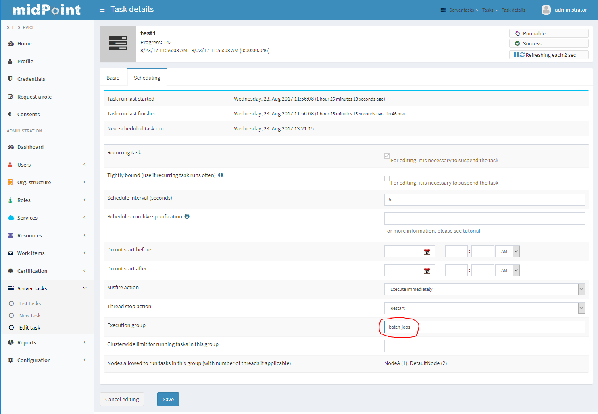
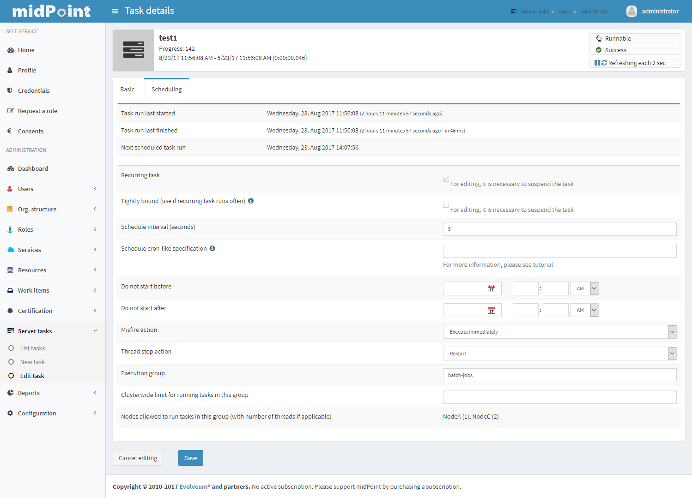

= Node-Sticky Tasks
:page-wiki-name: Node-sticky tasks HOWTO
:page-wiki-id: 24674876
:page-wiki-metadata-create-user: mederly
:page-wiki-metadata-create-date: 2017-07-28T17:17:00.521+02:00
:page-wiki-metadata-modify-user: mederly
:page-wiki-metadata-modify-date: 2019-07-20T01:31:45.773+02:00
:page-upkeep-status: yellow

Sometimes it is necessary to "bind" a task to a given node or a set of nodes.
In midPoint 3.5, an (very experimental and untested) approximation of this feature was available, as part of `task/executionConstraints/allowedNode` and `disallowedNode` structures.
But starting from 3.7 this feature is implemented correctly.

== Task execution groups

Each task belongs to exactly one execution group: either to the default (unnamed) one or to a named one.

MidPoint can then impose certain restrictions on these groups:

. for named groups, *cluster-wide limit* for concurrent executions of tasks in this group can be set,

. for both named groups and the default one, *node-specific limits* for concurrent executions can be set.
It is even possible to forbid execution of group's tasks on given node.

An execution group for a task is set using `executionConstraints/group` item in the task or via GUI:

=== Setting cluster-wide limits

Currently there is no repository object representation for task groups.
Therefore, cluster-wide limits for execution of tasks in such groups have to be set within the tasks themselves (again, via repository objects or GUI).
This is obviously cumbersome, because one has to keep this information synchronized for all tasks in the given group.
In the future this will be improved.

Note that cluster-wide limits can be specified only for named groups.

=== Setting node-specific limits

Each node in midPoint cluster has its own thread pool for executing tasks.
(Unless the scheduler on that node is stopped, of course.) The usual size of the pool is 10 threads, but can be configured to any other value using xref:/midpoint/reference/tasks/task-manager/configuration/[task manager configuration]. Besides this configuration, a node can declare which execution groups it accepts, and for how many threads.

The declaration is basically a map of group names to limitations.
The default setting (after node initialization) is this:

[%autowidth]
|===
| Group | Limitation | Meaning

| (none)
| (none)
| Execution of tasks in default (unnamed) group is not limited.
The only limit is overall thread pool size.

| _current node name_
| (none)
| Execution of tasks in the group that is named after the node (e.g. NodeC) is also not limited.

| *
| 0
| Execution of any other tasks is forbidden on this node.

|===

The configuration can be changed via Repository Objects, after opening the Node object.
It looks like this:

.Default execution limitations for a node named NodeC
[source,xml]
----
<node xmlns="http://midpoint.evolveum.com/xml/ns/public/common/common-3" ... >
   <name>NodeC</name>
   ...
   <taskExecutionLimitations>
      <groupLimitation>
         <groupName/>
      </groupLimitation>
      <groupLimitation>
         <groupName>NodeC</groupName>
      </groupLimitation>
      <groupLimitation>
         <groupName>*</groupName>
         <limit>0</limit>
      </groupLimitation>
   </taskExecutionLimitations>
</node>
----

Note that missing `limit` element means null value, i.e. no limit for given group.
For the default (unnamed) group, the `groupName` element can be either missing or have empty content - as in the example above - to achieve better understandability.

If we would allow tasks in group e.g. `batch-jobs` to execute in at most two threads on a given node, we could add the following configuration:

[source]
----
<groupLimitation>
  <groupName>batch-jobs</groupName>
  <limit>2</limit>
</groupLimitation>
----

Then, after putting a task into `batch-jobs` group, it will be executed on NodeC in at most 2 threads.
If an administrator configured NodeA to allow 1 thread for this group as well, the situation would look like this:

On the bottom of the form we can see this task will be allowed to execute on NodeA in 1 thread and on NodeC in 2 threads, provided these nodes are up, with scheduler running and enough free threads are available.

=== Applying node-specific limitation changes

After a change is done using repository objects page, it will be applied within 10 seconds.
This is ensured by the cluster management thread.
In the log file there will be an information on the change:

[source]
----
2017-08-23 14:08:02,152 [TASK_MANAGER] [ClusterManagerThread] INFO (com.evolveum.midpoint.task.quartzimpl.execution.ExecutionManager): Quartz scheduler execution limits set to: {null=null, batch-jobs=2, *=0, NodeC=null} (were: {null=null, *=0, NodeC=null})
----

Note that it is possible that some tasks that were in the process of trigger acquisition by the Quartz Scheduler (the underlying task scheduling mechanism) would be started on "disallowed" node if they are scheduled to run shortly after the limitations change.
But this transition should take only a few seconds during normal circumstances.

== Static limitations definition

Starting from midPoint 4.0, these limitations can be defined also statically in `config.xml` or using analogous method via `-D`  cmdline switch.
They are applied on midPoint startup: they overwrite any information present in the node object.
If the node object is changed afterwards, these settings are applied, but are discarded on following start of midPoint.

An example:

[source,xml]
----
<configuration>
  <midpoint>
    <taskManager>
      <taskExecutionLimitations>admin-node:2,sync-jobs,#:13,_:40</taskExecutionLimitations>
      ...
    </taskManager>
    ...
  </midPoint>
</configuration>
----

Or, the same via command line:

[source]
----
... "-Dmidpoint.taskManager.taskExecutionLimitations=admin-node:2,sync-jobs,#:13,_:40"
----

The format is:

. individual items are separated by comma characters;

. an item is in the form of:

.. <group>:<n> (meaning a limit of `n` for this particular group)

.. or <group>:* (meaning no limit for this particular group)

.. or <group> (meaning no limit for this particular group),

. where `group` is either a specific name, or

.. `#` denotes current node name,

.. `_` denotes blank group name (i.e. tasks in default - unnamed group),

.. `*` denotes tasks in any other named group.

So, the above example of `admin-node:2,sync-jobs,#:13,_:40`  means:

* 2 threads for tasks in `admin-node` group,

* unlimited threads for tasks in `sync-jobs`  group,

* 13 threads for tasks in group equal to the current node name,

* 40 threads for tasks in unnamed group,

* plus the default setting of 0 threads in any other named group.

Example 2: The usual default settings can be written as `_,#,*:0` or, perhaps more expressively, as `_:*,#:*,*:0`.
