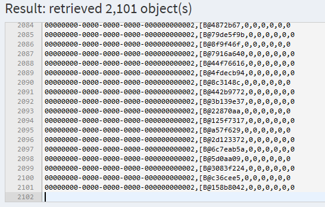
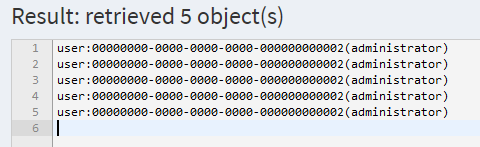

= Redundant Objects Processing Elimination
:page-wiki-name: Redundant objects processing elimination HOWTO
:page-wiki-id: 24676774
:page-wiki-metadata-create-user: mederly
:page-wiki-metadata-create-date: 2018-04-04T20:03:06.088+02:00
:page-wiki-metadata-modify-user: mederly
:page-wiki-metadata-modify-date: 2018-04-04T20:19:04.502+02:00
:page-upkeep-status: orange

It often happens that a query yields multiple occurrences of the same object.
When using such a query to drive e.g. focus recomputation or arbitrary bulk action execution, it may happen that some objects are processed more than once.
See e.g. bug:MID-4495[] or bug:MID-3293[].

== An example

Let us have user `administrator` that has assigned these 5 roles: `Superuser`, `End user`, `Approver`, `Reviewer`, and `Delegator`.

And now let us consider the following bulk action.
It is intended to process all users that have an assignment of either `Superuser`, `End user`, `Approver`, `Reviewer`, or `Delegator` role (or any combination of them).

.Simple attempt to select all users having any of given roles
[source,xml]
----
<task xmlns="http://midpoint.evolveum.com/xml/ns/public/common/common-3"
      xmlns:c="http://midpoint.evolveum.com/xml/ns/public/common/common-3"
      xmlns:q="http://prism.evolveum.com/xml/ns/public/query-3"
      xmlns:t="http://prism.evolveum.com/xml/ns/public/types-3"
      xmlns:xsi="http://www.w3.org/2001/XMLSchema-instance"
      xmlns:org="http://midpoint.evolveum.com/xml/ns/public/common/org-3"
      xmlns:scext="http://midpoint.evolveum.com/xml/ns/public/model/scripting/extension-3"
      xmlns:s="http://midpoint.evolveum.com/xml/ns/public/model/scripting-3">
    <name>script users</name>
    <executionStatus>runnable</executionStatus>
    <extension>
        <scext:executeScript>
            <s:search>
                <s:type>c:UserType</s:type>
                <s:query>
                    <q:filter>
                        <!-- Approver, Delegator, End user, Reviewer or Superuser role -->
                        <q:text>
                            assignment matches (
                                targetRef matches (oid = '00000000-0000-0000-0000-00000000000a' and type = c:RoleType) or
                                targetRef matches (oid = '00000000-0000-0000-0000-00000000000c' and type = c:RoleType) or
                                targetRef matches (oid = '00000000-0000-0000-0000-000000000008' and type = c:RoleType) or
                                targetRef matches (oid = '00000000-0000-0000-0000-00000000000b' and type = c:RoleType) or
                                targetRef matches (oid = '00000000-0000-0000-0000-000000000004' and type = c:RoleType))
                        </q:text>
                    </q:filter>
                </s:query>
                <s:action>
                    <s:type>execute-script</s:type>
                    <s:parameter>
                        <s:name>script</s:name>
                        <c:value xsi:type="c:ScriptExpressionEvaluatorType">
                            <c:code>
                                log.info('Hello {}', input)
                            </c:code>
                        </c:value>
                    </s:parameter>
                </s:action>
            </s:search>
        </scext:executeScript>
    </extension>
    <ownerRef oid="00000000-0000-0000-0000-000000000002" />
    <category>BulkActions</category>
    <handlerUri>http://midpoint.evolveum.com/xml/ns/public/model/scripting/handler-3</handlerUri>
    <recurrence>single</recurrence>
</task>
----

How many times is the code executed for the `administrator`?

Before answering that, let us have a look at HQL code produced by the above query.
We get it if we enter the query into query playground:

.Query to be analyzed in the playground
[source,xml]
----
<q:query xmlns:q="http://prism.evolveum.com/xml/ns/public/query-3" xmlns:c="http://midpoint.evolveum.com/xml/ns/public/common/common-3" xmlns:xsi="http://www.w3.org/2001/XMLSchema-instance">
    <q:filter>
        <q:or>
            <q:ref>
                <q:path>assignment/targetRef</q:path>
                <q:value xsi:type="c:ObjectReferenceType" oid="00000000-0000-0000-0000-00000000000a" type="c:RoleType" />    <!-- Approver -->
            </q:ref>
            <q:ref>
                <q:path>assignment/targetRef</q:path>
                <q:value xsi:type="c:ObjectReferenceType" oid="00000000-0000-0000-0000-00000000000c" type="c:RoleType" />    <!-- Delegator -->
            </q:ref>
            <q:ref>
                <q:path>assignment/targetRef</q:path>
                <q:value xsi:type="c:ObjectReferenceType" oid="00000000-0000-0000-0000-000000000008" type="c:RoleType" />    <!-- End user -->
            </q:ref>
            <q:ref>
                <q:path>assignment/targetRef</q:path>
                <q:value xsi:type="c:ObjectReferenceType" oid="00000000-0000-0000-0000-00000000000b" type="c:RoleType" />    <!-- Reviewer -->
            </q:ref>
            <q:ref>
                <q:path>assignment/targetRef</q:path>
                <q:value xsi:type="c:ObjectReferenceType" oid="00000000-0000-0000-0000-000000000004" type="c:RoleType" />    <!-- Superuser -->
            </q:ref>
        </q:or>
    </q:filter>
</q:query>
----

HQL looks like this (after substituting the variables):

.Resulting HQL query
[source,java]
----
select
  u.oid,
  u.fullObject,
  u.stringsCount,
  u.longsCount,
  u.datesCount,
  u.referencesCount,
  u.polysCount,
  u.booleansCount
from
  RUser u
    left join u.assignments a with a.assignmentOwner = 0
    left join u.assignments a2 with a2.assignmentOwner = 0
    left join u.assignments a3 with a3.assignmentOwner = 0
    left join u.assignments a4 with a4.assignmentOwner = 0
    left join u.assignments a5 with a5.assignmentOwner = 0
where
  (
    (
      a.targetRef.targetOid = '00000000-0000-0000-0000-00000000000a' and
      a.targetRef.relation in ('#', 'http://midpoint.evolveum.com/xml/ns/public/common/org-3#default') and
      a.targetRef.type = 7
    ) or
    (
      a2.targetRef.targetOid = '00000000-0000-0000-0000-00000000000c' and
      a2.targetRef.relation in ('#', 'http://midpoint.evolveum.com/xml/ns/public/common/org-3#default') and
      a2.targetRef.type = 7
    ) or
    (
      a3.targetRef.targetOid = '00000000-0000-0000-0000-000000000008' and
      a3.targetRef.relation in ('#', 'http://midpoint.evolveum.com/xml/ns/public/common/org-3#default') and
      a3.targetRef.type = 7
    ) or
    (
      a4.targetRef.targetOid = '00000000-0000-0000-0000-00000000000b' and
      a4.targetRef.relation in ('#', 'http://midpoint.evolveum.com/xml/ns/public/common/org-3#default') and
      a4.targetRef.type = 7
    ) or
    (
      a5.targetRef.targetOid = '00000000-0000-0000-0000-000000000004' and
      a5.targetRef.relation in ('#', 'http://midpoint.evolveum.com/xml/ns/public/common/org-3#default') and
      a5.targetRef.type = 7
    )
  )

----

(Note that `com.evolveum.midpoint.repo.sql.data.common.other.RAssignmentOwner.FOCUS` = `0` and `com.evolveum.midpoint.repo.sql.data.common.other.RObjectType.ROLE` = `7`)

So we are constructing 6-tuples of objects `(u, a, a2, a3, a4, a5)` where `u` is the user (`administrator`) and either:

. `a` is `Approver` assignment, or

. `a2` is `Delegator` assignment, or

. a3 is `End user` assignment, or

. a4 is `Reviewer` assignment, or

. a5 is `Superuser` assignment.

How many such tuples exist? The easiest way of counting them is to take all possible tuples of (a, a2, a3, a4, a5) - which is *5^5^ = 3125* and then exclude all non-compliant ones.
Non-compliant tuples are those that have a != Approver and a2 != Delegator and a3 != End user and a4 != Reviewer and a5 != Superuser.
How many of them exist? Each of a, a2, ..., a5 has only 4 possibilities.
So, these are *4^5^ = 1024*. Therefore, there are 3125 - 1024 = *2101 compliant objects*, as can be confirmed by the query interpreter:

Therefore, if such a query is used in bulk action task or recomputation task or similar one, each user having all of the mentioned 5 role assignments is processed 2101 times (!).

== Limiting the redundancy, step 1: Exists filter

The above has been known for some time.
In order to limit the redundancies, provides filter: `exists`. When used it looks like this:

[source,xml]
----
<q:query xmlns:q="http://prism.evolveum.com/xml/ns/public/query-3" xmlns:c="http://midpoint.evolveum.com/xml/ns/public/common/common-3" xmlns:xsi="http://www.w3.org/2001/XMLSchema-instance">
    <q:filter>
        <q:text>
            assignment matches (
                targetRef matches (oid = '00000000-0000-0000-0000-00000000000a' and type = c:RoleType) or
                targetRef matches (oid = '00000000-0000-0000-0000-00000000000c' and type = c:RoleType) or
                targetRef matches (oid = '00000000-0000-0000-0000-000000000008' and type = c:RoleType) or
                targetRef matches (oid = '00000000-0000-0000-0000-00000000000b' and type = c:RoleType) or
                targetRef matches (oid = '00000000-0000-0000-0000-000000000004' and type = c:RoleType))
        </q:text>
    </q:filter>
</q:query>
----

It says: give me all users that have an assignment that has a target either Approver, or Delegator, ..., or Superuser.

The results are much better, but not ideal:

The reason is the way HQL is currently being constructed:

[source]
----
select
  u.oid,
  u.fullObject,
  u.stringsCount,
  u.longsCount,
  u.datesCount,
  u.referencesCount,
  u.polysCount,
  u.booleansCount
from
  RUser u
    left join u.assignments a with a.assignmentOwner = 0
where
  (
    (
      a.targetRef.targetOid = '00000000-0000-0000-0000-00000000000a' and
      a.targetRef.relation in ('#', 'http://midpoint.evolveum.com/xml/ns/public/common/org-3#default') and
      a.targetRef.type = 7
    ) or
    (
      a.targetRef.targetOid = '00000000-0000-0000-0000-00000000000c' and
      a.targetRef.relation in ('#', 'http://midpoint.evolveum.com/xml/ns/public/common/org-3#default') and
      a.targetRef.type = 7
    ) or
    (
      a.targetRef.targetOid = '00000000-0000-0000-0000-000000000008' and
      a.targetRef.relation in ('#', 'http://midpoint.evolveum.com/xml/ns/public/common/org-3#default') and
      a.targetRef.type = 7
    ) or
    (
      a.targetRef.targetOid = '00000000-0000-0000-0000-00000000000b' and
      a.targetRef.relation in ('#', 'http://midpoint.evolveum.com/xml/ns/public/common/org-3#default') and
      a.targetRef.type = 7
    ) or
    (
      a.targetRef.targetOid = '00000000-0000-0000-0000-000000000004' and
      a.targetRef.relation in ('#', 'http://midpoint.evolveum.com/xml/ns/public/common/org-3#default') and
      a.targetRef.type = 7
    )
  )
----

We return tuples of `(u, a)` where `u` is the user and `a` are its assignments complying with the condition.
For `administrator` there are 5 such assignments, yielding 5 results.

It is much better than 2101 results and it might be reduced to 1 in the future, after we slightly change the way how HQL is constructed  if the performance point of view would allow.

== Limiting the redundancy, step 2: 'distinct' option

Until that time, there are two remaining options.

The first one consists of additional filtering of search results in bulk action interpreter or iterative search task handler.
This should be implemented in midPoint, and would comprise a small CPU/memory overhead.
We would have to maintain a list of already processed OIDs and eliminate all attempts to redundantly process objects with OIDs already present in the list.
It might be workable with a bit of quirks (e.g. limiting results via paging would not work).

And the second one is available today: it uses the `distinct` option to be used in search queries.
The use of the option is context-dependent.
Here we show the use within bulk actions and recomputation tasks.

=== Distinct option in bulk actions

.Bulk action with 'distinct' query option

[source,xml]
----
<task xmlns="http://midpoint.evolveum.com/xml/ns/public/common/common-3"
      xmlns:c="http://midpoint.evolveum.com/xml/ns/public/common/common-3"
      xmlns:q="http://prism.evolveum.com/xml/ns/public/query-3"
      xmlns:t="http://prism.evolveum.com/xml/ns/public/types-3"
      xmlns:xsi="http://www.w3.org/2001/XMLSchema-instance"
      xmlns:org="http://midpoint.evolveum.com/xml/ns/public/common/org-3"
      xmlns:scext="http://midpoint.evolveum.com/xml/ns/public/model/scripting/extension-3"
      xmlns:s="http://midpoint.evolveum.com/xml/ns/public/model/scripting-3">
    <name>script users (distinct)</name>
    <executionStatus>runnable</executionStatus>
    <extension>
        <scext:executeScript>
            <s:search>
                <s:type>c:UserType</s:type>
                <s:query>
                    <q:filter>
                        <!-- Approver, Delegator, End user, Reviewer or Superuser role -->
                        <q:text>
                            assignment matches (
                                targetRef matches (oid = '00000000-0000-0000-0000-00000000000a' and type = c:RoleType) or
                                targetRef matches (oid = '00000000-0000-0000-0000-00000000000c' and type = c:RoleType) or
                                targetRef matches (oid = '00000000-0000-0000-0000-000000000008' and type = c:RoleType) or
                                targetRef matches (oid = '00000000-0000-0000-0000-00000000000b' and type = c:RoleType) or
                                targetRef matches (oid = '00000000-0000-0000-0000-000000000004' and type = c:RoleType))
                        </q:text>
                    </q:filter>
                </s:query>
                <s:options>
                    <c:option>
                        <c:options>
                            <c:distinct>true</c:distinct>
                        </c:options>
                    </c:option>
                </s:options>
                <s:action>
                    <s:type>execute-script</s:type>
                    <s:parameter>
                        <s:name>script</s:name>
                        <c:value xsi:type="c:ScriptExpressionEvaluatorType">
                            <c:code>
                                log.info('Hello {}', input)
                            </c:code>
                        </c:value>
                    </s:parameter>
                </s:action>
            </s:search>
        </scext:executeScript>
    </extension>
    <ownerRef oid="00000000-0000-0000-0000-000000000002" />
    <category>BulkActions</category>
    <handlerUri>http://midpoint.evolveum.com/xml/ns/public/model/scripting/handler-3</handlerUri>
    <recurrence>single</recurrence>
</task>
----

Note the code:

[source,xml]
----
                <s:options>
                    <c:option>
                        <c:options>
                            <c:distinct>true</c:distinct>
                        </c:options>
                    </c:option>
                </s:options>
----

=== Distinct option in recomputation task

When doing recomputation (or basically any iterative task), `mext:searchOptions` extension item has to be used:

.User recomputation with 'distinct' search option
[source,xml]
----
<task xmlns="http://midpoint.evolveum.com/xml/ns/public/common/common-3"
    xmlns:c="http://midpoint.evolveum.com/xml/ns/public/common/common-3"
    xmlns:mext="http://midpoint.evolveum.com/xml/ns/public/model/extension-3"
    xmlns:q="http://prism.evolveum.com/xml/ns/public/query-3"
    xmlns:xsi="http://www.w3.org/2001/XMLSchema-instance">

    <name>User Recompute (distinct)</name>
    <extension>
        <mext:objectQuery>
            <q:filter>
                <!-- Approver, Delegator, End user, Reviewer or Superuser role -->
                <q:text>
                    assignment matches (
                        targetRef matches (oid = '00000000-0000-0000-0000-00000000000a' and type = c:RoleType) or
                        targetRef matches (oid = '00000000-0000-0000-0000-00000000000c' and type = c:RoleType) or
                        targetRef matches (oid = '00000000-0000-0000-0000-000000000008' and type = c:RoleType) or
                        targetRef matches (oid = '00000000-0000-0000-0000-00000000000b' and type = c:RoleType) or
                        targetRef matches (oid = '00000000-0000-0000-0000-000000000004' and type = c:RoleType))
                </q:text>
            </q:filter>
        </mext:objectQuery>
        <mext:objectType>UserType</mext:objectType>
        <mext:searchOptions>
            <option>
                <options>
                    <distinct>true</distinct>
                </options>
            </option>
        </mext:searchOptions>
    </extension>
    <ownerRef oid="00000000-0000-0000-0000-000000000002"/>
    <executionStatus>runnable</executionStatus>
    <handlerUri>http://midpoint.evolveum.com/xml/ns/public/model/synchronization/task/recompute/handler-3</handlerUri>
    <recurrence>single</recurrence>
</task>
----

The `distinct` option may have some effects on performance, perhaps depending on DBMS used and other circumstances.
(It has to be tried in a particular environment to find out.)
