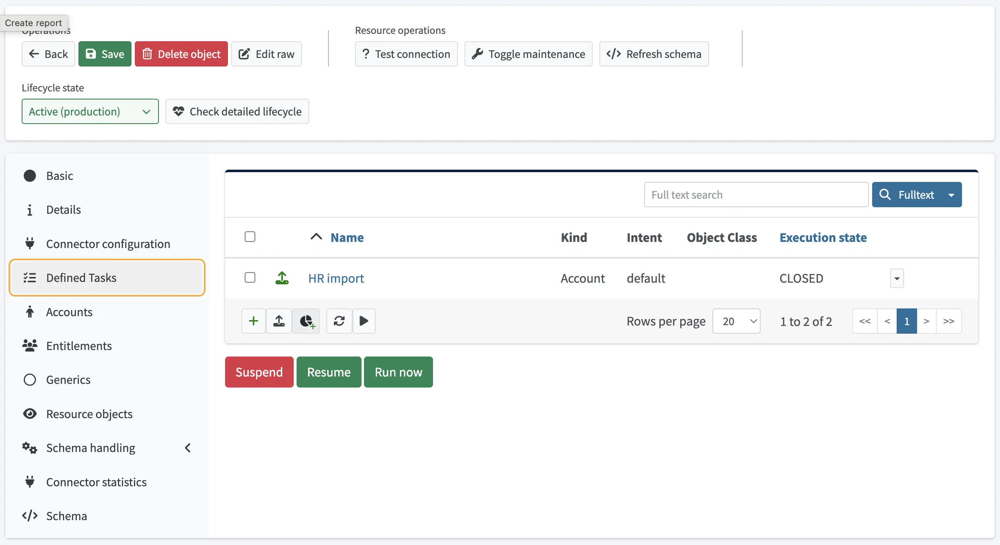
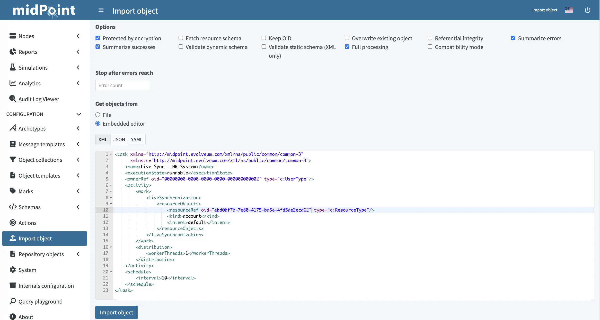

= Create a live sync task how-to
:toc:
:toclevels: 3
:icons: font
:experimental:
:page-description: This guide shows how to create a live synchronization task in midPoint which polls a resource for changes and propagates them into midPoint.
:page-keywords: live synchronization, live sync, task, inbound, resource, change log, change token, polling

This guide shows how to create a minimal live synchronization task in midPoint which polls a resource for changes and propagates them into midPoint.

== Prerequisites

* A running midPoint instance (4.4 or later).
* A configured, tested resource whose connector supports live synchronization.
Verify the green Live Sync xref:/midpoint/reference/admin-gui/resource-wizard/object-type/capability/[capability] indicator on the resource detail page before proceeding. +
You can do this by going to [.nowrap]#icon:database[] btn:[Resources]# > _resource_ > [.nowrap]#icon:info[] btn:[Details]# and checking [.nowrap]#icon:rotate[] btn:[Live Sync]# is enabled (green).
* The OID of that resource.
This is visible in:
** The resource URL - Following `objectId=`, for example `ebd0bf7b-7e80-4175-ba5e-4fd5de2ecd62`.
** The resource XML - Open the resource, click [.nowrap]#icon:edit[] btn:[Edit raw]#, and check the `oid` attribute of the `<resource>` element. 
* For verification, the ability to create or modify accounts directly on the resource (LDAP browser, DB client, etc.).

== Configuration overview

A live sync task is a `TaskType` object with an activity of type `liveSynchronization`.
It references a resource and one specific object class on that resource (xref:/midpoint/reference/resources/shadow/kind-intent-objectclass/[kind + intent]).

[%autowidth]
|===
| Approach | Best suited for

| GUI
| First-time setup, manual creation, ad-hoc tasks for short-term troubleshooting.

| XML
| Reproducible deployments where the task definition is part of the system configuration package.
|===

== Create live sync task

=== Option A — GUI

////
. Navigate to [.nowrap]#icon:tasks[] btn:[Server tasks]# > [.nowrap]#icon:plus-circle[] btn:[New task]#.
. Choose [.nowrap]#icon:sync-alt[] btn:[Live Synchronization Task]#.
. Click the [.nowrap]#icon:circle[] btn:[Basic]# tab and set the task as follows:
+
[%autowidth]
|===
| Attribute | Value

| Name             | `Live Sync — HR System`
| Execution status | `runnable`
|===

. **Resource objects** — bind the task to the resource and object class to synchronise:
+
[%autowidth]
|===
| Attribute | Value

| Resource | (select your resource)
| Kind     | `account`
| Intent   | `default`
|===

. On the [.nowrap]#icon:calendar[] btn:[Schedule]# tab, configure recurrence:
+
[%autowidth]
|===
| Attribute | Value

| Recurrence | Recurring
| Interval  | `10` (seconds)
|===

. Click **Save**. The task appears in **Server tasks → All tasks** and starts according to its schedule.

[TIP]
====
A shortcut is available on the resource itself: open the resource detail page, choose **Tasks → New live sync task**. midPoint pre-fills the resource reference and most of the boilerplate, leaving only the schedule to configure.
====

////

. Navigate to [.nowrap]#icon:database[] btn:[Resources]# > _resource_ > [.nowrap]#icon:tasks[] btn:[Defined Tasks]#
. Click [.nowrap]#icon:plus[] btn:[New task]#.

+

. Click [.nowrap]#icon:sync-alt[] btn:[Live synchronization task]#.
. Set the following and click btn:[Next:Resource objects]:

+
[%autowidth]
|===
| Attribute | Value

| Name             | `Live Sync — HR System`
|===

. Set the following and click btn:[Next:Schedule]:

+
[%autowidth]
|===
| Attribute | Value

| Resource | (select your resource)
| Kind     | `account`
| Intent   | `default`
|===

. Set *Interval* to `10` (seconds) and click btn:[Next:Distribution].
. Click [.nowrap]#icon:check[] btn:[Save $ Run]#.

=== Option B — XML

. In the application main menu, navigate to [.nowrap]#icon:upload[] btn:[Import object]#
. In the *Get object from* section, select *Embedded editor*.
. Paste the following XML into the editor:

+
[source,xml]
----
<task xmlns="http://midpoint.evolveum.com/xml/ns/public/common/common-3"
      xmlns:c="http://midpoint.evolveum.com/xml/ns/public/common/common-3">
    <name>Live Sync — HR System</name>
    <executionState>runnable</executionState>
    <ownerRef oid="00000000-0000-0000-0000-000000000002" type="c:UserType"/>
    <activity>
        <work>
            <liveSynchronization>
                <resourceObjects>
                    <resourceRef oid="REPLACE-WITH-RESOURCE-OID" type="c:ResourceType"/>
                    <kind>account</kind>
                    <intent>default</intent>
                </resourceObjects>
            </liveSynchronization>
        </work>
        <distribution>
            <workerThreads>1</workerThreads>
        </distribution>
    </activity>
    <schedule>
        <interval>10</interval>
    </schedule>
</task>
----

. Replace `REPLACE-WITH-RESOURCE-OID` with the resource OID, and adjust `kind`/`intent` if the resource defines additional object types.

+

. Click btn:[Import object].

== Verification

. Confirm the task is running by going to [.nowrap]#icon:tasks[] btn:[Server tasks]# > [.nowrap]#icon:tasks[] btn:[All tasks]#.
The new task should be listed there with a recent *Last run* timestamp.
. Create or modify an account on the source resource. For an LDAP resource, add a new entry under the search base.
. Wait for one polling interval (10 seconds in the example).
. In midPoint, navigate to [.nowrap]#icon:user[] btn:[Users]# > [.nowrap]#icon:user[] btn:[All users]#.
The new account should be represented as a user (created, updated, or linked according to the resource's synchronization reactions).
. Open the task and inspect the [.nowrap]#icon:chart-line[] btn:[Operation statistics]# tab.
The counters for processed objects should have advanced.

== See also

* link:https://docs.evolveum.com/midpoint/reference/master/synchronization/introduction/[Introduction to synchronization]
* link:https://docs.evolveum.com/midpoint/reference/master/tasks/specific-tasks/livesync/[Live synchronization task]
* link:https://docs.evolveum.com/midpoint/reference/master/synchronization/reactions/[Synchronization reactions]
* link:https://docs.evolveum.com/midpoint/reference/master/tasks/specific-tasks/reconciliation/[Reconciliation task]
