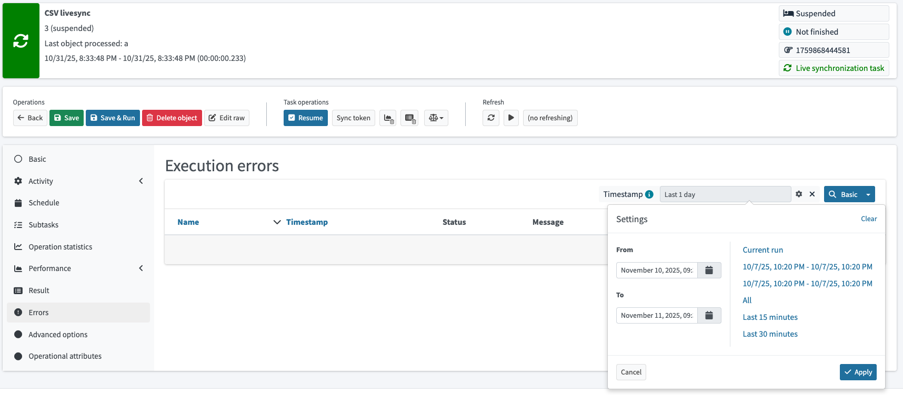

= Tasks errors
:page-since: "4.10"
:page-upkeep-status: green

MidPoint user interface allows searching for errors for specific task run realization.
Search widget can also list all available task run realization history for given task.

.Task run errors search widget displaying last three task run intervals

To achieve this, new data structure `taskRunRecord` is stored in task object when starting new run realization.
This structure contains following data:

* `taskRunIdentifier`
* `runStartTimestamp`
* `runEndTimestamp`

`taskRunIdentifier` is also stored in each `operationExecution` in objects processed during that task run.

To avoid `operationExecution` count explosion, old record it's now replaced with new one if error is the same.
This has to take into account new `taskRunIdentifier`, and it's replaced only if `taskRunIdentifier` is the same.

To further limit accumulation of `taskRunRecord` in the task and `operationExecution` in objects, new configuration options was created in `SystemConfigurationType`.
Maximum number of `operationExecution` items in object is by default 5, and maximum number of records per task is 3.

.Example of cleanup policy configuration
[source,xml]
----
<systemConfiguration xmlns="http://midpoint.evolveum.com/xml/ns/public/common/common-3">
    <!-- other configuration ommitted for brevity -->
    <cleanupPolicy>
        <simpleOperationExecutions>
            <maxRecords>5</maxRecords>
            <maxRecordsPerTask>3</maxRecordsPerTask>
        </simpleOperationExecutions>
        <complexOperationExecutions>
            <maxRecords>5</maxRecords>
            <maxRecordsPerTask>3</maxRecordsPerTask>
        </complexOperationExecutions>
    </cleanupPolicy>
</systemConfiguration>
----

== See also

* Related issue bug:MID-10411[]
