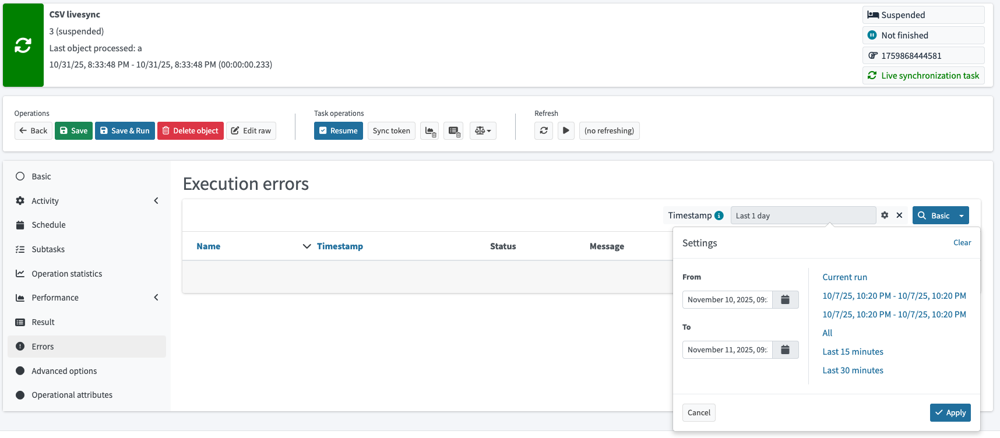
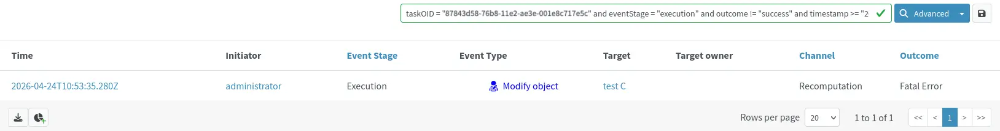

= Tasks errors
:page-since: "4.10"
:page-upkeep-status: green
:page-toc: top
:experimental:
:page-keywords: task, error, operation execution, cleanup policy
:page-description: This page explains how to search for task errors in midPoint and how to configure error record cleanup policy.

MidPoint user interface allows searching for errors for specific task run realization.
Search widget can also list all available task run realization history for given task.

.Task run errors search widget displaying last three task run intervals

To achieve this, new data structure `taskRunRecord` is stored in task object when starting new run realization.
This structure contains following data:

* `taskRunIdentifier`
* `runStartTimestamp`
* `runEndTimestamp`

`taskRunIdentifier` is also stored in each `operationExecution` in objects processed during that task run.

To avoid `operationExecution` count explosion, old record it's now replaced with new one if error is the same.
This has to take into account new `taskRunIdentifier`, and it's replaced only if `taskRunIdentifier` is the same.

To further limit accumulation of `taskRunRecord` in the task and `operationExecution` in objects, new configuration options was created in `SystemConfigurationType`.
Maximum number of `operationExecution` items in object is by default 5, and maximum number of records per task is 3.

.Example of cleanup policy configuration
[source,xml]
----
<systemConfiguration xmlns="http://midpoint.evolveum.com/xml/ns/public/common/common-3">
    <!-- other configuration ommitted for brevity -->
    <cleanupPolicy>
        <simpleOperationExecutions>
            <maxRecords>5</maxRecords>
            <maxRecordsPerTask>3</maxRecordsPerTask>
        </simpleOperationExecutions>
        <complexOperationExecutions>
            <maxRecords>5</maxRecords>
            <maxRecordsPerTask>3</maxRecordsPerTask>
        </complexOperationExecutions>
    </cleanupPolicy>
</systemConfiguration>
----

== Search errors with Audit Log Viewer

Alternatively, you can also search for errors in tasks using the Audit Log Viewer:

. Get the task OID. +
In GUI, this is available in the URL of a task details page, e.g., `87843d58-76b8-11e2-ae3e-001e8c717e5c`. +

. Go to [.nowrap]#icon:magnifying-glass-chart[] btn:[Audit Log Viewer]# in the application's left-side menu.
. Switch [.nowrap]#icon:search[] btn:[Search]# in the right upper corner to the Advanced mode.
. Search for execution errors for the task using a xref:/midpoint/reference/concepts/query/midpoint-query-language/[query]. +
For example, the following query will search execution errors for the task with OID `87843d58-76b8-11e2-ae3e-001e8c717e5c` that occurred after January 1, 2026:

+
[source,xml]
----
taskOID = "87843d58-76b8-11e2-ae3e-001e8c717e5c" and eventStage = "execution" and outcome != "success" and timestamp >= "2026-01-01""
----

+

+
You do not have to specify a timestamp in the query. It is used in the example to avoid filtering through all records in the audit log which, depending on the number of records, could be more resource demanding.

. Review the error detail by clicking the link in the *Target* column.

== See also

* Related issue bug:MID-10411[]
